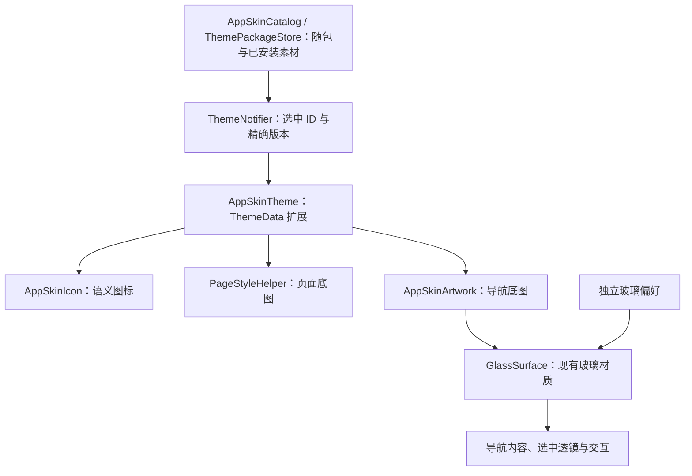

# 应用配色、素材主题与主题市场

主题唯一入口位于“我的 > 偏好设置”的“主题与外观”卡片，“我的”首页不再重复展示。主题页提供 6 套协调配色、原始外观、3 套随包素材主题，并从这里进入社区主题市场。配色、素材、明暗模式、玻璃材质和阅读器纸张/字体/背景分别保存，应用或移除主题包不会改写玻璃与阅读偏好。

## 配色、入口与持久化

- `lib/utils/app_themes.dart`：`AppThemes.colorPresets` 定义稳定 ID `blue`、`forest`、`amber`、`rose`、`violet`、`graphite`，各自提供浅色/深色主色、辅助色和第三色的完整 Material 3 角色（含 fixed 角色）。默认蓝保持旧方案。
- `lib/services/core/theme_notifier.dart`：`setColorPreset(id)` 保存 `appColorPresetIdV1`，同时维护兼容键 `appAccentColorV2`。新用户及旧默认蓝绑定 `blue`；历史非默认任意强调色保持原值，在主题页以“原有配色”展示，直到用户主动选择套餐。失效 ID 清理后保留旧颜色。旧自由色盘、名称表和翻译适配器已删除，旧色值读取/备份契约保留。
- `lib/pages/settings/app_theme_page.dart`：配色/贴图两类卡片，使用真实渲染器的预览，手机大字体单列与平板双栏布局，选中语义和素材致谢入口。每类选择有操作版本与当前值校验，早期失败不能重试覆盖较新选择。
- `lib/widgets/app_theme_summary_card.dart` 和设置页 `parts/settings_hub_part.dart`：统一摘要入口，沿用设置页懒构建。显示效果与字体/布局分组独立，避免把玻璃参数混入主题套餐。

配色、皮肤和主题包选择共用一条顺序写入队列，按用户选择顺序保存并恢复。保存失败保持即时视觉选择，通过包含原始错误与堆栈的日志和“重试”提示暴露；后续选择可以继续保存，同一选择可重试。阅读偏好与玻璃开关/样式/不透明度始终使用各自原有键。

## 所有权与切换链



- `lib/models/app_skin.dart`：不可变素材与语义槽。`AppSkinImageSource` 区分随包资源与安装文件；`ThemePackage` 仅生成已校验的绝对文件引用，ThemeExtension 不读盘、不解 ZIP。
- `lib/services/core/theme_notifier.dart`：恢复与保存 `appSkinIdV1`，通过 `setSkin(id)` 通知现有主题树。连续选择按顺序写入；恢复已移除的 ID 会返回原始皮肤并清理旧键。未知的新选择明确报错。
- `lib/utils/app_skin_theme.dart`：只承载当前已解析的皮肤，不承载目录、控制器或解码缓存。浅色、深色主题由 `lib/main.dart` 注入同一皮肤描述；图片切换采用离散插值。
- `lib/widgets/app_skin_icon.dart`：按语义槽位和选中状态解析图片，贴图目标尺寸统一为系统图标的 1.5 倍，导航、公共按钮和主题预览共用这一比例。图片以实际尺寸参与布局，并在按钮或导航的可用空间内等比缩小；内置和社区素材遵守同一规则，不依赖透明留白。导航为文字预留空间，大字体平板标签保留完整高度；隐藏标签时，图标与贴图随标签动画放大，手机字形基准由 27 增至 34，平板由 23 增至 34。外层点击区域、玻璃材质、标签和调用方动画保持各自所有权；缺失或加载失败时恢复原系统图标。彩色贴图不被强调色染色。公共返回、搜索、更多入口通过同一适配器解析已有标准图标，其他图标保持原样。
- `lib/utils/page_style_helper.dart` 的 `backgroundDecoration`：背景所有者在现有渐变或颜色上混合底图（浅色 35%、深色 24%），保留文字可读性，不改变布局和命中。首页、书库、书源、AI、设置和普通二级页接入此入口。
- `lib/widgets/app_skin_artwork.dart`：只把导航装饰以浅色 22%、深色 16% 绘制在玻璃下面，裁切装饰本身。它不裁切导航内容，不新增模糊，不修改玻璃参数。

## 随包素材与素材定义

当前 `AppSkinCatalog.builtIn` 包含 `original`、`tidal`（海边来信）、`botanical`（花园漫读）、`celestial`（星际漫游）。后 3 套使用原有 IconPark 线描素材、新增原创动作几何与原创背景，覆盖 62 个槽位的浅色/深色/选中四种状态；返回、搜索等公共按钮也由同一主题替换。素材清单、来源与维护规则见[素材目录](app-skin-assets.md)，随包授权通过 `registerAppSkinLicenses()` 注入应用许可证页。

`AppSkinIconSlot` 是前后端共同维护的 62 个稳定语义槽，全部纳入首个正式主题协议 V1。导航与常用动作包括：`home`、`library`、`discover`、`ai`、`profile`、`back`、`search`、`more`、`close`、`forward`、`settings`、`refresh`、`add`、`share`、`delete`、`check`。导航槽由 `HomeNavigationDestination` 映射，公共操作由 `AppSkinIcon.commonSlot` 统一适配，不从索引、译文或页面条件分支推导。缺少整个槽或加载失败时回退调用方的系统图标。

阅读、播放、管理与偏好动作包括：`bookmark`、`catalog`、`readAloud`、`locate`、`play`、`pause`、`stop`、`previous`、`next`、`rewind`、`fastForward`、`speed`、`timer`、`volume`、`volumeOff`、`expand`、`collapse`、`remove`、`filter`、`sort`、`layoutGrid`、`layoutList`、`download`、`upload`、`folder`、`createFolder`、`moveFolder`、`edit`、`copy`、`note`、`highlight`、`history`、`help`、`info`、`cloud`、`sync`、`save`、`restore`、`link`、`palette`、`font`、`image`、`device`、`key`、`extension`、`network`。62 个槽全部可选，部分主题只需提供想替换的槽；播放、暂停、停止、跳章、快进、快退保持不同语义。

`AppSkinIcon.adapt` 只接管已知 `Icon` 叶子，保留原图标对象、颜色透明度、尺寸、语义和文字方向；`selected` 显式状态优先，书签和朗读活动状态保持独立。阅读控制栏、图片阅读控制栏、自动翻页、选择菜单、目录/搜索/设置面板、触区编辑、注释工具、听书播放器/跟读，以及设置/书架标题与菜单共用此入口。播放、暂停、睡眠定时、播放面板与语音引擎使用实际状态选择贴图。品牌标志、书封面、加载动画和系统状态仍各自维护，不从 Widget 树递归替换。下划线、特殊翻页方式、顶部/底部对齐等没有准确语义槽的图标保留原字形，不借用含义不同的贴图。


`AppSkinArtworkSlot.pageBackground` 是共用页面底图，`navigation` 是悬浮导航底图。公共页面 wrapper 在有皮肤底图时把背景交给实际页面所有者；rail 外壳保留自己的渐变，避免再绘制整页贴图。书库转场的临时面板使用同一解析结果，避免转场时闪回默认背景。

每张 `AppSkinImage` 支持 `asset` 和可选 `darkAsset`；缺少深色图时使用普通图。图标的 `AppSkinIconAssets` 支持 `normal` 和可选 `selected`，选中图缺省时复用普通图。当前支持 PNG、WebP、JPEG，资源路径必须在 `assets/` 下；SVG 需在制作阶段导出为支持的图片格式。

新增皮肤先在 Flutter `pubspec.yaml` 声明实际素材目录，再加入 `AppSkinCatalog.builtIn` 的静态定义。例如：

```dart
AppSkin(
  id: 'ocean',
  icons: {
    AppSkinIconSlot.library: AppSkinIconAssets(
      normal: AppSkinImage(asset: 'assets/skins/ocean/library.png'),
      selected: AppSkinImage(asset: 'assets/skins/ocean/library-selected.png'),
    ),
  },
  artwork: {
    AppSkinArtworkSlot.pageBackground:
        AppSkinImage(asset: 'assets/skins/ocean/background.webp'),
    AppSkinArtworkSlot.navigation:
        AppSkinImage(asset: 'assets/skins/ocean/navigation.png'),
  },
)
```

素材作者和授权文件随素材保留。先以统一语义槽试用部分图片，缺少的槽位沿用原图标/背景，不需要复制页面、导航组件或建立皮肤专属条件分支。

## 社区主题包、安装与联网边界

主题包 V1 制作、投稿与审核规范见官网仓库的 `docs/theme-market.md`，唯一完整模板来自官网 `/theme-template.zip`，由 Next.js 的 `web/public/theme-template.zip` 提供。主题功能此前未正式发布，本次将完整契约统一为 `schemaVersion: 1`。主题页的市场入口通过官网 API 展示审核通过的主题，创作入口打开 `/themes/create`。桌面 APP 图标切换不属于主题包契约。

`lib/models/theme_package.dart` 只解析纯数据 `manifest.json`，严格要求整数 `schemaVersion: 1`，拒绝其他协议值和未知图标槽。ZIP 只允许根目录清单/授权/README 和 `assets/` 下静态 PNG、JPEG、WebP；不允许脚本、字体、动画、网络 URL 或无关文件。限制为压缩 10 MiB、展开 20 MiB、最多 512 个条目（含目录项）、清单 64 KiB、合计 2400 万解码像素；图标必须带透明通道、为不超过 512×512 的正方形，预览最大 1600×1600，背景最大 2048×2048。服务端重新编码图片与 ZIP，客户端仍独立校验。市场列表使用 `GET /api/v1/themes`，预览与下载仅携带主题自身的 `?version=N`，没有协议版本协商。主题自身的正整数 `version` 与协议、人工审核状态分开维护。安装收据、原有存储目录和用户设置沿用原格式；开发期间的 schema 2 包不自动改写，需按正式模板重新提交。

`ThemePackageStore` 检查市场的 ID、精确版本、长度和 SHA-256，再读取 ZIP、解码图片并写入随机 staging。目录 rename 发布不可变版本，收据记录每个文件的哈希。重新加载核对文件集合、哈希与祖先链接边界；损坏包跳过，保存的版本失效时回退默认外观，不会自动启用新版。重新下载同版本时，完整有效版本仍拒绝覆盖；只有新包全部验证通过且原目录确认损坏、安全时，才把原目录原子移到随机隔离目录并发布新目录。发布失败恢复原目录，成功后清理隔离目录。

`appThemePackageSelectionV1` 分别记录素材与配色的 ID/精确版本。纯配色包只替换配色层，纯素材包只替换素材层，组合包替换两层；未提供的层保留原来的精确引用。安装新版不会替换任一层仍在使用的旧版；市场同时显示最新版和当前素材、配色旧版。删除未选中的新版不会清除旧版选择。启动只读取两项保存引用，进入市场后才按需扫描全部本地版本。

`appSkinImageProvider` 为公共渲染器统一提供 AssetImage/FileImage。市场、预览、流式下载及创作入口服从全局联网授权；撤回授权会清除远端展示并让在途请求失效，已安装主题仍可离线切换和删除。Web 构建不支持本地包安装。

## 玻璃、阅读器及异常边界

`AppSkin` 只包含图标和背景；`ThemePackage.palette` 可提供应用三色配色，但包不能提供材质模式、玻璃样式、模糊/不透明度或阅读偏好。毛玻璃、液态玻璃、关闭效果和 Material 3 继续遵循[共用玻璃材质](glass-material.md)的策略。实底策略可以遮住导航底图，这是可读性策略；高对比模式关闭页面底图和导航装饰。

导航图片仍处于原有的两层选择淡入淡出之内，标签、点击热区、弹性透镜和安全区由原组件负责。背景和装饰不接收点击、不增加无障碍节点。不要把整条导航裁切或为每套皮肤重新做一份玻璃滤镜。

图片加载失败通过 Flutter 错误报告保留路径和错误证据；图标返回原 `Icon`，背景保留原渐变，导航保留原玻璃。缺少槽位是正常的部分皮肤契约，与损坏资源的错误报告区别处理。

`ReaderThemePalette.toThemeData(parentTheme: ...)` 继承皮肤扩展和玻璃扩展，同时保留自己的纸张颜色和背景图；阅读画布不调用应用底图解析器。图片缓存由 Flutter 的 AssetImage/FileImage/ImageCache 管理，不引入第二份磁盘缓存或静态图片控制器。

## 验证入口与当前限制

- `test/app_color_presets_test.dart`：6 套浅/深配色、完整角色来源、文字对比度和默认蓝兼容。
- `test/app_color_preset_state_test.dart`：默认/旧色迁移、失效 ID、顺序保存、失败重试和偏好隔离。
- `test/app_theme_page_test.dart`：选择、真实素材、失败重试/快速选择竞态、选中语义、点击区域、大字体/长文案/平板与无障碍策略。
- `test/settings_theme_entry_test.dart`：设置摘要入口和自由色盘移除。
- `test/theme_package_model_test.dart`、`theme_package_store_test.dart`、`theme_package_state_test.dart`：唯一 V1 的完整 62 槽与未知协议拒绝、含目录的 512 条目边界、恶意包、Windows 路径、链接、精确版本、损坏重装、独立两层组合与重启恢复。`test/fixtures/theme-template.zip` 是服务端归一化的完整正式模板，`theme-template-partial.zip` 覆盖可选槽缺省；两者均为 V1。
- `test/theme_market_api_test.dart`、`theme_market_page_test.dart`：官方 URL、联网撤回、流式长度、远程/本地市场操作和布局。
- `test/app_skin_assets_test.dart`：实际随包素材解码及许可证注册。
- `test/app_skin_test.dart`：目录、路径、不可变集合、明暗/选中解析及主题插值。
- `test/app_skin_state_test.dart`：选择恢复、连续持久化、旧 ID 清理、玻璃/强调色/明暗/阅读偏好隔离。
- `test/app_skin_rendering_test.dart`：真实导航和背景接入、图片失败、点击/标签/尺寸、高对比、玻璃策略及阅读器继承。
- `test/app_skin_common_actions_test.dart`、`test/reader_skin_entrypoints_test.dart`：公共动作映射、选中优先级、未知图标精确回退，以及阅读控制栏和触区入口。
- `test/reader_aloud_panel_test.dart`：原播放器交互与布局回归，以及真实主题播放/暂停素材在 320 px、两倍字体下的切换。
- `tool/preview_theme_controls.dart`：原始及三套素材主题的浅/深色控制栏与菜单、窄屏大字体、平板共 20 张真实 Flutter 预览；证据见 [2026-10-10 图标覆盖与协议验证](reviews/2026-10-10-theme-icon-coverage.md)。
- 原有 `home_bounce_navigation_item`、`elastic_pill_navigation_bar`、`tablet_home_shell`、`home_shell_system_bar`、`floating_subpage_scaffold`、`shared_glass_background`、`glass_material_consumers`、`reader_theme_glass_policy` 套件独立进程执行。
- `tool/preview_theme_gallery.dart`：真实 iOS Flutter 的配色页、浅/深贴图页、1024 平板、大字体和偏好设置预览。桌面模拟器载体用 FittedBox 承载完整设计尺寸，截图取内部 RepaintBoundary。本次原生渲染截图见 [2026-10-10 新素材与主题市场预览](previews/theme-market-20261010/README.md)，它不等同于用户真机视觉验收。
- `tool/preview_app_skin.dart`：真实 Flutter 渲染的原始/贴图毛玻璃/液态/深色/实底/高对比预览，仅复用已有随包图片验证架构，不注册为生产皮肤。

主题包 V1 不支持脚本、字体、动画素材、远程图片、玻璃/阅读器配置或系统桌面图标切换。Dart 文件 API 缺少跨平台 openat/O_NOFOLLOW；逐级 lstat、解析根路径和操作前复核覆盖常规链接攻击，但同权限本机恶意进程并发替换目录的 TOCTOU 仍是沙箱外边界。自动化覆盖契约、安装、选择与联网门禁；真实创作者投稿/人工审核、用户真机视觉和交互另行验收，文档不代替部署或设备收据。
