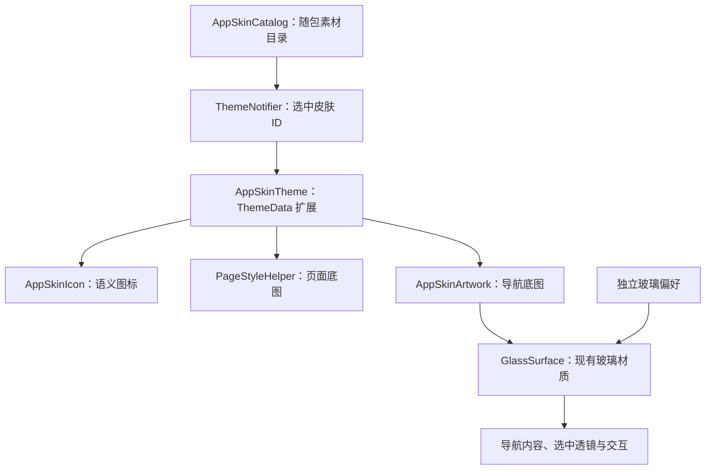

# 应用素材皮肤

应用皮肤替换 UI 图片素材，独立于强调色、明暗模式和玻璃材质。当前默认目录只含 `original`，不改变已有用户的外观，也不显示尚无素材的选择入口。阅读纸张、字体、背景图继续由阅读器设置管理。

## 所有权与切换链



- `lib/models/app_skin.dart`：不可变素材、语义槽位及目录。构造时校验 ID、随包资源路径和重复定义，不允许覆盖 `original`。
- `lib/services/core/theme_notifier.dart`：恢复与保存 `appSkinIdV1`，通过 `setSkin(id)` 通知现有主题树。连续选择按顺序写入；恢复已移除的 ID 会返回原始皮肤并清理旧键。未知的新选择明确报错。
- `lib/utils/app_skin_theme.dart`：只承载当前已解析的皮肤，不承载目录、控制器或解码缓存。浅色、深色主题由 `lib/main.dart` 注入同一皮肤描述；图片切换采用离散插值。
- `lib/widgets/app_skin_icon.dart`：按语义槽位和选中状态解析图片，沿用原图标尺寸、标签和调用方动画；彩色贴图不被强调色染色。公共返回、搜索、更多入口通过同一适配器解析已有标准图标，其他图标保持原样。
- `lib/utils/page_style_helper.dart` 的 `backgroundDecoration`：背景所有者在现有渐变或颜色上绘制底图，不改变布局和命中。首页、书库、书源、AI、设置和普通二级页接入此入口。
- `lib/widgets/app_skin_artwork.dart`：只把导航装饰绘制在玻璃下面，裁切装饰本身。它不裁切导航内容，不新增模糊，不修改玻璃参数。

## 素材定义

`AppSkinIconSlot` 包含首页、书库、发现、AI、个人页、返回、搜索和更多。首页槽位从 `HomeNavigationDestination` 映射，不从索引、译文或图标形状推导，因此导航重排与隐藏不会串图。

`AppSkinArtworkSlot.pageBackground` 是共用页面底图，`navigation` 是悬浮导航底图。公共页面 wrapper 在有皮肤底图时把背景交给实际页面所有者；rail 外壳保留自己的渐变，避免再绘制整页贴图。书库转场的临时面板使用同一解析结果，避免转场时闪回默认背景。

每张 `AppSkinImage` 支持 `asset` 和可选 `darkAsset`；缺少深色图时使用普通图。图标的 `AppSkinIconAssets` 支持 `normal` 和可选 `selected`，选中图缺省时复用普通图。当前支持 PNG、WebP、JPEG，资源路径必须在 `assets/` 下；SVG 需在制作阶段导出为支持的图片格式。

新增皮肤先在 Flutter `pubspec.yaml` 声明实际素材目录，再加入 `AppSkinCatalog.builtIn` 的静态定义。例如：

```dart
AppSkin(
  id: 'ocean',
  icons: {
    AppSkinIconSlot.library: AppSkinIconAssets(
      normal: AppSkinImage(asset: 'assets/skins/ocean/library.png'),
      selected: AppSkinImage(asset: 'assets/skins/ocean/library-selected.png'),
    ),
  },
  artwork: {
    AppSkinArtworkSlot.pageBackground:
        AppSkinImage(asset: 'assets/skins/ocean/background.webp'),
    AppSkinArtworkSlot.navigation:
        AppSkinImage(asset: 'assets/skins/ocean/navigation.png'),
  },
)
```

素材作者和授权文件随素材保留。先以统一语义槽试用部分图片，缺少的槽位沿用原图标/背景，不需要复制页面、导航组件或建立皮肤专属条件分支。

## 玻璃、阅读器及异常边界

皮肤不包含材质模式、玻璃样式、模糊数值、颜色或阅读偏好字段。毛玻璃、液态玻璃、关闭效果和 Material 3 继续遵循[共用玻璃材质](glass-material.md)的策略。实底策略可以遮住导航底图，这是可读性策略；高对比模式关闭页面底图和导航装饰。

导航图片仍处于原有的两层选择淡入淡出之内，标签、点击热区、弹性透镜和安全区由原组件负责。背景和装饰不接收点击、不增加无障碍节点。不要把整条导航裁切或为每套皮肤重新做一份玻璃滤镜。

图片加载失败通过 Flutter 错误报告保留路径和错误证据；图标返回原 `Icon`，背景保留原渐变，导航保留原玻璃。缺少槽位是正常的部分皮肤契约，与损坏资源的错误报告区别处理。

`ReaderThemePalette.toThemeData(parentTheme: ...)` 继承皮肤扩展和玻璃扩展，同时保留自己的纸张颜色和背景图；阅读画布不调用应用底图解析器。皮肤的缓存由 Flutter 的 AssetImage/ImageCache 管理，不引入第二份磁盘缓存或静态图片控制器。

## 验证入口与当前限制

- `test/app_skin_test.dart`：目录、路径、不可变集合、明暗/选中解析及主题插值。
- `test/app_skin_state_test.dart`：选择恢复、连续持久化、旧 ID 清理、玻璃/强调色/明暗/阅读偏好隔离。
- `test/app_skin_rendering_test.dart`：真实导航和背景接入、图片失败、点击/标签/尺寸、高对比、玻璃策略及阅读器继承。
- 原有 `home_bounce_navigation_item`、`elastic_pill_navigation_bar`、`tablet_home_shell`、`home_shell_system_bar`、`floating_subpage_scaffold`、`shared_glass_background`、`glass_material_consumers`、`reader_theme_glass_policy` 套件独立进程执行。
- `tool/preview_app_skin.dart`：真实 Flutter 渲染的原始/贴图毛玻璃/液态/深色/实底/高对比预览，仅复用已有随包图片验证架构，不注册为生产皮肤。

当前不包含皮肤商店、下载/import、运行时 JSON manifest、动画贴图或手机桌面图标切换。后续下载功能需要独立的安装、授权、版本和校验边界，先验证 manifest 再解析成运行时模型；不要把文件 IO 或不可信解析混入 ThemeExtension。
