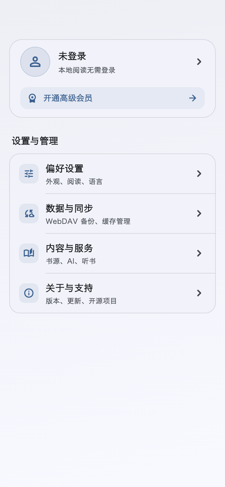
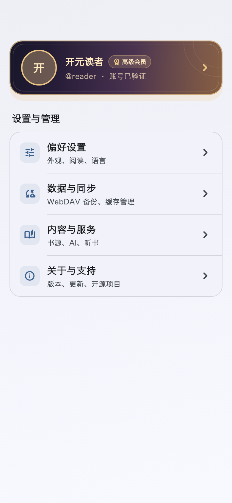
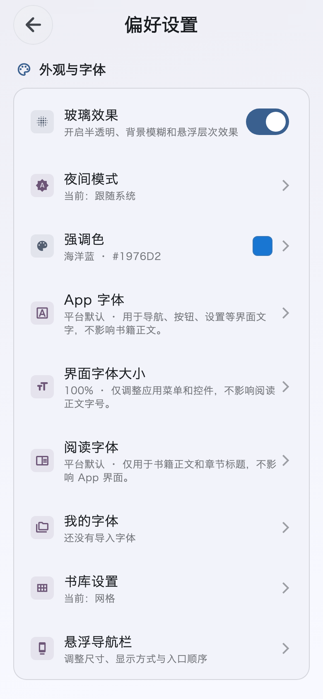

# “我的”页面改版概念稿

状态：已实现，2026-09-25。下方是真实 Flutter 控件渲染；最初的双卡概念稿已被合并卡片方案取代。

## 判断

现有设置页已包含账户卡，但账户、购买权益、外观、阅读、书源、同步、AI、通用开关和关于信息连续排在同一页面。问题主要是不同任务同层展示，用户需要滚动并逐段扫描；改名为“我的”本身不能解决密度。

底栏“设置”改为“我的”，首屏成为入口页。用户信息和高级版合在一张卡片里：已开通时只显示紧凑的会员身份卡，昵称旁保留会员徽章；未开通时在身份区下方增加一条小型开通入口。同步中或失败时，小入口显示对应状态，不贸然宣称权益已开通。

## 页面结构

“我的”首页：

1. 用户与高级版合并卡：头像、昵称或未登录状态；仅未开通时，在同一张卡片内用浅色圆角小入口自然衔接，不使用横向分界线。点击后进入当前分发渠道的开通页面并定位到购买区域。Apple 渠道展示 App Store 购买，其他渠道展示现有开通与兑换方式。未登录仍可继续使用本地阅读；付款前先登录账号。
2. 设置与管理：四个清晰入口，每项保持一行摘要。
   - 偏好设置：外观、阅读、语言、书架布局、导航布局。
   - 数据与同步：WebDAV、缓存管理。同步异常时，入口摘要直接显示“需要处理”。
   - 内容与服务：书源管理、替换规则、AI 助手、云端 TTS；已有的高级功能开关归这里的“书源能力”。
   - 关于与支持：版本、更新日志、开源许可、项目链接，以及适用分发渠道的支持入口。

二级页直接提供原有开关和操作，不再继续以大卡片套菜单。阅读器内的阅读排版快捷入口继续保留，避免常用调整必须退到“我的”。

## 状态与边界

- 游客、已登录普通用户、已开通高级版、权益同步中或失败分别展示准确状态；游客可访问全部本地偏好设置。
- 已开通状态的合并卡片使用现有高级版深色渐变、金色描边与纹样；仅昵称旁显示会员标识，不再增加权益入口或重复的“已开通”文案。
- 四个首页入口始终可见；如果某项需要登录或高级版权益，仅在具体功能处解释原因和下一步。
- 手机单列，宽屏采用左侧合并卡、右侧设置与管理的双栏布局。放大字体时卡片内容换行，列表项增长高度，不截断功能名称。
- 保留当前所有设置能力和现有页面入口，不把 WebDAV 误写为高级版特权；支持/捐赠入口继续遵循现有分发渠道规则。

## 设计依据

依据根目录 `DESIGN.md` 的本地优先、无强制登录、现有主题和组件约束；对照 `lib/pages/settings/parts/settings_layout_part.dart`、`lib/widgets/settings_account_card.dart`、`lib/pages/account/premium_membership_page.dart` 和底栏导航实现盘点入口。图中文字与示例状态仅用于布局讨论，正式实现须复用本地化文案和真实账户/同步状态。
