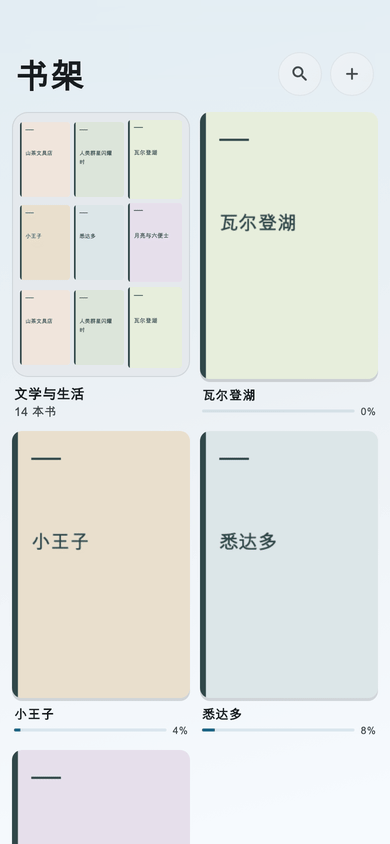

# 嵌套书架导航动画预览

本目录保存真实 Flutter widget 渲染的 80 张图片，使用测试书籍与文件夹数据，页面及返回按钮来自产品代码。

- `phone-light`：390 × 844，浅色；打开 0–320ms、返回 0–288ms，按 16ms 捕获。
- `phone-dark`：390 × 844，深色；包含打开、返回中间帧。
- `narrow-large-text`：320 × 700，1.5 倍字号；包含打开、返回中间帧。
- `tablet`：834 × 1194，宽屏；包含打开、返回中间帧。
- 各场景保留根目录、子目录、多选、返回完成四种静态状态。



GIF 由浅色手机场景的 43 张状态/中间帧合成，390 × 844、3.33 秒。它用于观察转场顺序，不用于衡量实体设备帧率。

生成方法：

```sh
SHELF_MOTION_SCREENSHOTS=1 flutter test --no-pub test/library_shelf_responsive_test.dart
```

最后一轮视觉检查通过：移动表面使用当前主题背景，文字无父子画面叠影；返回定位在父目录恢复滚动后重新测量。目标文件夹被筛选隐藏时使用淡出，系统减少动态效果时关闭缩放和平移。

相关测试分别在独立进程运行：目录交互 9 项、书库 7 项、平板壳层 4 项、导航动画 8 项、响应式渲染 1 项，共 29 项通过。动画用例覆盖中间帧、按钮按压与进退、重复返回防跳级、滚动恢复、旋转后的目标定位、筛选隐藏目标、减少动态效果及提前退出时的资源释放。范围静态分析及 diff whitespace 检查通过。

这些图片和测试不代替 SloanePro 上的实体操作手感验收。安装、版本回读与启动证据记录在功能计划中。
