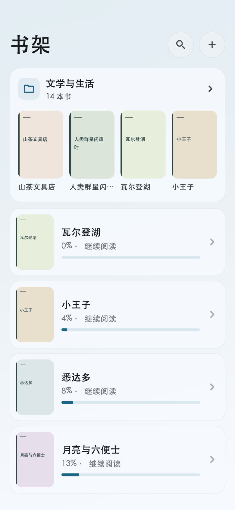

# 分组卡片与网格密度

真实 Flutter 页面渲染，使用合成书籍与封面。14 种场景覆盖嵌套导航、横向预览、明暗主题、空目录、单本、窄屏和大字号；另保存完整卡片展开与返回的中间帧。

手机可选 2–5 列，封面最小宽度约 64dp。390dp 正常字号可以 5 列，320dp 自动 4 列；有书名/进度或目录信息时，大字号继续减少列数。目录文字始终预留高度，书籍封面保持 2:3。宽屏最多 8 列。

| 场景 | 画面 |
| --- | --- |
| 深色卡片 | [查看](phone-card-dark-root.png) |
| 进入子书架 | [查看](phone-card-light-folder.png) |
| 横向滑至预览末尾 | [查看](phone-card-light-preview-end.png) |
| 单本与作者 | [查看](phone-card-single-root.png) |
| 空目录 | [查看](phone-card-empty-root.png) |
| 320dp、2倍字号卡片 | [查看](narrow-card-large-text-root.png) |
| 390dp、5列 | [查看](phone-five-columns-root.png) |
| 320dp、自动4列 | [查看](narrow-five-columns-root.png) |
| 2倍字号、自动3列 | [查看](phone-five-columns-large-text-root.png) |
| 3倍字号、隐藏书籍信息、自动2列 | [查看](phone-five-columns-cover-only-large-text-root.png) |
| 平板密度 | [查看](tablet-five-columns-root.png) |
| 展开中间帧 | [查看](phone-card-light-open-160.png) |
| 返回中间帧及按钮退出 | [查看](phone-card-light-back-140.png) |

这些渲染与交互回归不能代表实体设备帧率或手感。3倍字号截图中，既有共享顶栏标题的截断边界已另行记录。本轮没有修改该共享顶栏。
