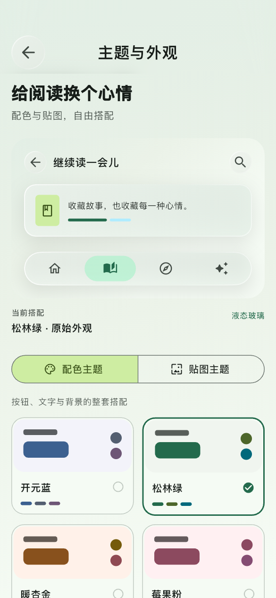
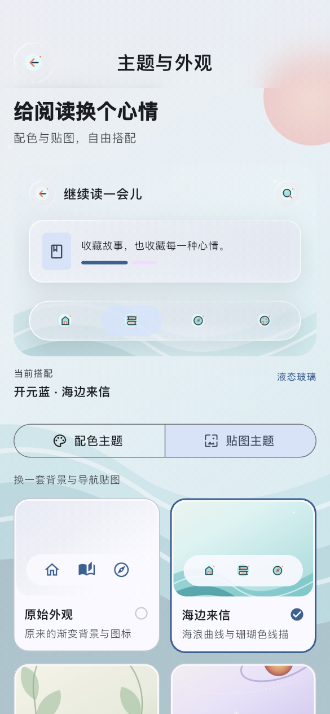
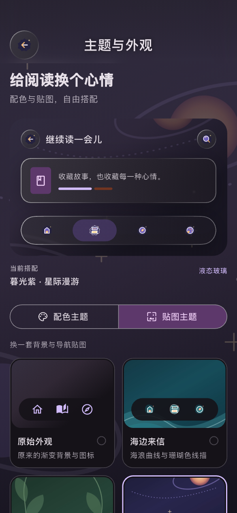
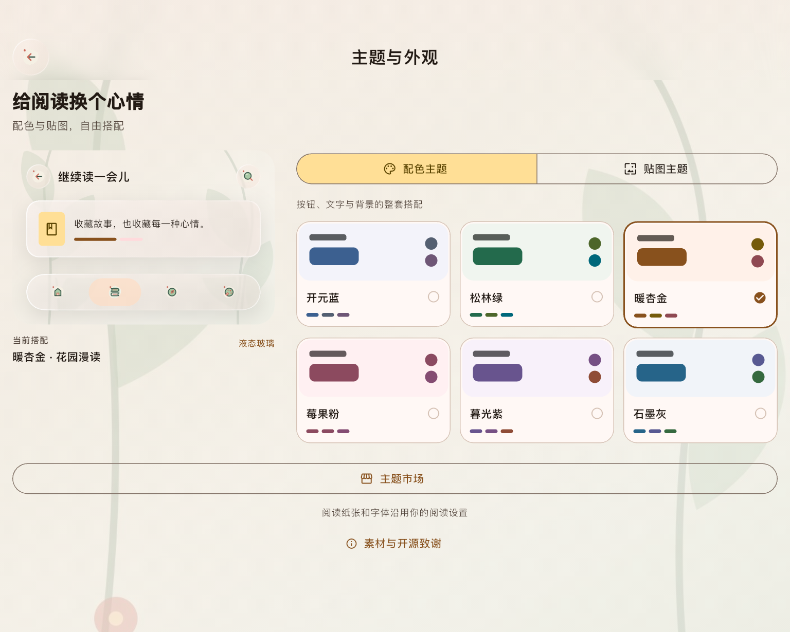
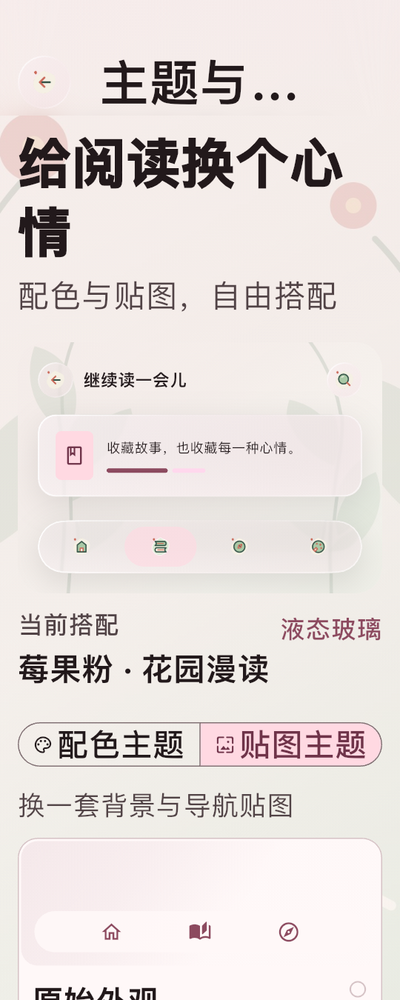
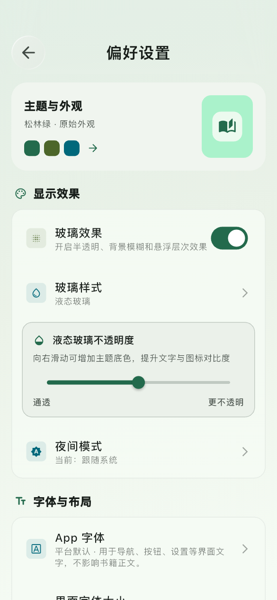

# 主题系统原生 iOS 预览（2026-10-10）

这组截图由 `tool/preview_theme_gallery.dart` 在已启动的 iPhone 18 Pro Max 模拟器上运行真实 Flutter iOS 应用后，通过页面内部 `RepaintBoundary` 输出。它覆盖主题配色、浅色与深色贴图、平板布局、2 倍大字和偏好设置入口。

本次预览使用模拟器 `B747AC4A-A940-4BBC-A2BB-DE72F5EDE816`、Flutter 3.44.7、源码提交 `aaaee8651ad7334b90d98c728528def9784510a6`。构建使用独立 DerivedData：`build/theme-market/native-preview/xcode-derived-20261010`。完整构建日志、应用和截图哈希保存在被忽略的 `build/theme-market/native-preview/`。

## 预览

### 手机配色主题



原始外观保留玻璃顶栏、玻璃预览卡和原始返回、搜索图标；六套配色以双列卡片呈现。

### 手机浅色贴图主题



海边来信使用新版浅色背景及语义贴图。页面顶栏返回按钮、预览卡返回/搜索按钮和导航图标均由主题素材替换，未使用 emoji。

### 手机深色贴图主题



暮光紫使用对应深色背景、深色返回/搜索图标和导航素材。文字与玻璃描边在深色背景上保持清晰。

### 平板布局



1024×820 设计尺寸下，左侧保留实时主题预览，右侧显示三列配色卡；主题市场入口和素材致谢位于主题页底部。

### 手机大字体



360×900、2 倍文字缩放下改为单列内容。标题按现有顶栏规则省略，主题卡与切换控件保持可读、可滚动且无溢出。

### 偏好设置入口



偏好设置只展示一个“主题与外观”摘要入口；玻璃效果、字体与布局等既有设置保持原结构，没有重复的主题设置区块。

## 视觉结论

- 三套贴图主题共同使用 192 个新版语义图标素材；浅色、深色与选中状态按主题切换。
- 公共返回与搜索按钮在贴图主题中确实替换为主题图标，原始主题继续使用内置图标。
- 液态玻璃面板、按钮和描边在配色主题与贴图主题中都保留。
- 六张截图未发现 emoji 占位图、图片解码失败、布局溢出或重复的偏好设置入口。
- 这些截图证明模拟器原生 Flutter 渲染结果，不代替 SloanePro 真机视觉验收。

## 复现

```sh
FLUTTER_BUILD_DIR=/Volumes/Niki/Developer/builds/origo-x/build \
  /Users/xiaoyuan/flutter/bin/flutter build ios \
  --simulator --config-only \
  --target tool/preview_theme_gallery.dart

xcodebuild \
  -workspace ios/Runner.xcworkspace \
  -scheme Runner \
  -configuration Debug \
  -sdk iphonesimulator \
  -destination id=B747AC4A-A940-4BBC-A2BB-DE72F5EDE816 \
  -derivedDataPath /Volumes/Niki/Developer/builds/origo-x/build/theme-market/native-preview/xcode-derived-20261010 \
  ARCHS=arm64 ONLY_ACTIVE_ARCH=YES CODE_SIGNING_ALLOWED=NO build
```
