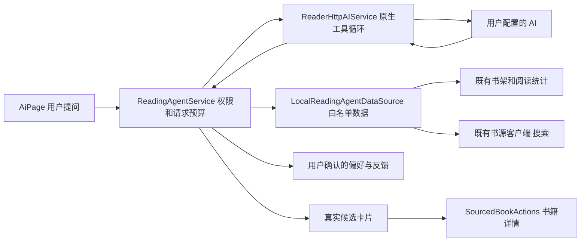

# 阅读 AI 与内置 Agent

这是当前维护入口。普通聊天、书籍摘要和阅读 Agent 使用同一套用户模型配置，但数据职责不同。维护前先查看 [文档入口](README.md)、本说明及下面的源码和回归测试。

## 用户入口与默认行为

- AI 导航页的空状态和输入框加号菜单提供“阅读 Agent 与记忆”。Agent 默认关闭，用户开启后才提供本设备数据工具；普通聊天和主动关联书籍的既有功能继续可用。
- 发送后，同一按钮变为“停止生成”。点击会取消当前模型请求及 Agent 的数据/书源查询，立即恢复发送状态，并保留已发送的用户消息。切换首页标签或打开其它页面时，请求继续执行，完成结果照常进入当前会话与历史；返回 AI 页可以看到执行状态或结果。
- 用户可以提问“最近读得怎么样”“根据我的偏好推荐下一本”。Agent 按需查询获准的数据，搜索启用的书源，展示真实书籍和逐本推荐理由。
- 卡片沿用 `SourcedBookActions` 的书籍详情、加入书架和阅读流程。反馈“感兴趣/不感兴趣”会保存在本设备，供后续推荐参考。
- AI 建议的偏好仅为待保存建议，用户点击保存后才进入长期记忆。设置中可以新增、修改、删除、清空偏好及反馈，也可以复制 Markdown 视图。
- 主动推荐默认关闭。用户明确提出希望持续推荐时，AI 可以展示开启入口，但模型不能修改开关。开启后，仅在前台进入 AI 页、没有当前对话且距上次成功推荐至少 24 小时时生成一次应用内消息；失败尝试至少间隔 30 分钟。当前没有操作系统推送、关闭应用后的定时任务或服务端消息投递。

## 模型、协议与连接配置

- `AiSettingsPage` 的模型卡片和 `AiModelEditorPage` 复用 `AIProviderSettings`。所有服务商均可选择“自动识别”、OpenAI Compatible、Anthropic Messages 或 Gemini；`protocol == null` 表示自动模式，显式协议优先。自动模式根据服务地址的协议特征识别，未知地址使用服务商默认协议，不会携带密钥试探其他主机。
- BigModel Coding Plan 可选择 GLM 预设，使用 `https://open.bigmodel.cn/api/anthropic` 与 `glm-5.3` / `glm-5.3-flash`；实际聊天地址为 `/api/anthropic/v1/messages`。也提供智谱 OpenAI 兼容预设。Base URL、协议和模型 ID 均可修改。
- `ai_configuration.dart` 保持自动协议在连续规范化、保存和恢复后不变；当剥离完整 endpoint 会丢失协议信号时，设置保留该 URL，由 `ai_protocol_adapter.dart` 在发请求时剥离并构造最终路径。`ai_settings_store.dart` 按服务商保存可选协议，兼容旧自定义协议和既有用户模型/地址，不用新版预设覆盖旧配置；仅刷新未配置、未修改的旧入门推荐卡片。快捷模型 JSON 保存 `protocol: null`，重新编辑仍保持自动识别。
- “获取模型列表”使用当前地址、密钥和有效协议，请求 OpenAI `/models`、Anthropic `/v1/models` 或 Gemini `/models`；支持各协议分页，去重排序后可搜索选择。地址、密钥或协议变化使旧请求结果失效。接口明确返回 404/405/501 时提示使用预设或手填 ID；鉴权错误仍按真实错误展示，不把内置预设冒充联网返回。
- `ai_model_presets.dart` 维护新建配置的模型 ID、端点、协议与品牌。模型来源记录在 [`assets/ai_providers/MODEL_SOURCES.md`](../assets/ai_providers/MODEL_SOURCES.md)，更新时查当前官方模型概览和账号模型列表，不能只看未退役名单。品牌图片随应用打包，无需联网加载；许可见该目录的 `NOTICE.md`。
- 普通聊天和 Agent 共用协议参数能力判断；当前 Claude 4.7+/5 系列省略不支持的温度参数，Gemini 3+ 使用官方推荐默认温度。Anthropic 两条请求路径共用有界的 8192 输出 token 预算，包含模型思考 token。
- 配置回归：`test/ai_configuration_test.dart`、`ai_settings_store_test.dart`、`ai_protocol_adapter_test.dart`、`ai_service_models_test.dart`、`ai_model_presets_test.dart`、`ai_settings_page_test.dart` 和 `ai_agent_service_test.dart`。配置页覆盖 GLM 自动识别、手动协议保留密钥、搜索选模型、晚到列表隔离、快捷模型恢复以及手机亮暗色和窄屏键盘布局。真实账号是否有模型权限，以及供应商是否提供列表，需要实际账号联网验收。

## 数据如何保存

| 数据 | 当前真相源 | 提供给模型的形式 |
| --- | --- | --- |
| 书架、书籍与真实进度 | 既有 `BookDao` / SQLite | 白名单字段、分页查询 |
| 阅读时长、趋势与会话 | 既有 `ReadingStatsDao` / SQLite | 带时间范围、单位和查询时刻的结构化结果 |
| 导入书源、规则与认证 | 既有 `BookSourceRegistry` 和 `BookSourceClient` | 本轮不透明别名、显示名称与能力；客户端代为搜索 |
| 用户确认的偏好、推荐反馈、权限与主动推荐时间 | `ai_reading_agent_v1`：带版本的本地 SharedPreferences JSON | 偏好只提供可见的 `text/origin`，反馈提供书名、作者与选择 |
| AI 对话与推荐卡片 | 既有 `AiChatHistoryStore` | 有界最近对话及应用记录的卡片顺序、书名、作者、来源显示名称、理由 |
| 预处理书籍摘要 | `Documents/ai_knowledge/books/<bookId>/memory.json` 的 `summary` | 用户主动关联书籍时使用摘要和笔记上下文 |

阅读事实不复制进“记忆”，避免过期数据、累计重复和反复维护。长期偏好最多 50 条、每条 500 字符，推荐反馈最多 50 条；小规模偏好使用版本化 JSON 已足够。Markdown 是可读导出，不是第二份可写真相源。大量段落语义检索若将来确有需求，再单独设计索引，不用向量库承载时长或进度事实。

这里的数据属于设备上的阅读资料，现有本地书架和阅读数据库没有按登录账号分区。Agent 没有把它们上传到 Origo 账号服务；调用用户配置的 AI 时，按权限发送该轮实际查询的结果。现有 WebDAV 备份排除 `ai_` 偏好；不要把本地偏好或聊天描述为已支持云同步或账号隔离。

## 调用链与所有权

- `lib/reader_core/ai/ai_service.dart` 是既有公开门面。普通 `AIService.chat` 接受可选 `CancelToken`，取消透传到共享 Dio 请求；设置加载前后均检查取消。`AgentAIService` 是可选工具能力接口。普通聊天和工具循环复用同一 HTTP 请求、响应解码和错误边界。
- `ai_agent_service.dart` 管理 OpenAI、Anthropic 和 Gemini 的原生工具往返。必须保留供应商原始 assistant 消息、tool call ID、blocks/parts 及签名，不用普通聊天的字符串历史替代这些消息。
- `ReadingAgentService` 负责每类数据权限、工具白名单、预算、取消和实际候选校验。整轮请求只登记一次 `AiRequestCoordinator.runInteractive`，后台书籍预处理在前台交互期间让行。
- `LocalReadingAgentDataSource` 复用 DAO、源注册表及客户端，按注入关系决定是否关闭客户端。`AiPage` 创建的 Agent 数据源在页面释放时关闭；注入的数据源由调用者负责释放。历史卡片与实时卡片共享展示组件。
- `ReadingAgentMemoryStore` 提供串行持久化变更；写入失败恢复旧内存状态并抛错，UI 不宣称保存成功。页面和测试可注入 store，没有新增全局记忆单例。
- `AiChatHistoryStore` 继续从应用根节点显式注入，Agent 不另建一份聊天历史。
- `AiPage` 复用首页已有的稳定目的地 key 与 `HomeKeepAlivePageWrapper`，每轮持有取消 token 和 generation。停止后可立即发起下一轮；启动模型前、工具提示和回答返回时都检查当前轮，旧请求的清理不能覆盖下一轮状态。真正释放页面和开启新对话会结束当前请求，不因失去标签焦点或临时应用生命周期变化主动取消。
- `GlobalAIReadingService` 与 `BookPreprocessService` 继续负责书籍内容摘要。它们不推断用户偏好、不替 Agent 修改权限；摘要写盘失败抛错，请求返回后重检取消，避免误报完成。

## 工具、权限与数据边界

| 工具 | 必需权限 | 作用 |
| --- | --- | --- |
| `reading_overview` | 阅读统计和书架 | 实际概况与最近阅读书籍 |
| `list_books` | 书架 | 书籍白名单元数据及真实进度 |
| `reading_statistics` / `reading_sessions` | 阅读统计 | 指定时段趋势、会话与分页累计单书统计 |
| `list_book_sources` / `search_books` | 书源 | 列出可搜索源、执行有界搜索 |
| `present_recommendations` | 书源 | 展示本轮搜索得到的 1–6 个真实候选 |
| `get_preferences` | Agent 已开启 | 用户保存的偏好与推荐反馈 |
| `suggest_preference` | Agent 已开启 | 最多 3 条临时建议，等待用户保存 |
| `suggest_proactive_recommendations` | Agent 已开启 | 提供设置入口，等待用户开启 |

Agent 默认关闭。开启时说明数据会发给用户配置的 AI；用户可以分别关闭阅读统计、书架和书源访问。工具在调用前和数据返回后重新校验权限。权限变化、用户停止、开启新会话、请求超时或页面释放会取消 Agent 请求并阻止晚到结果更新对话。切页后的持续执行依赖进程仍在运行，不是操作系统后台任务，系统挂起或退出进程后不能保证继续完成。

禁止直接向模型序列化 `Book.toMap()`、完整书源配置或 `BookSourceBook.toJson()`。模型不需要本地文件路径、真实源 ID/URL、私有书籍定位、Cookie、请求头、脚本、登录变量或 API 密钥。源配置和认证留在现有运行时，工具只提供白名单字段和本轮别名。可导入文字字段有长度限制；书名、简介、笔记、偏好及源返回值都作为数据，不能提升为权限或系统指令。

推荐必须来自本轮 `search_books`，不能由模型捏造 URL 或候选 ID。工具错误只返回有界稳定错误，不携带可能包含认证信息的原始源异常。源搜索结果标明实际查询覆盖、分页和失败，不把超时说成“没有书”。阅读时长、进度和会话只是行为证据，不能直接推断喜欢、弃书或读完。

## 统计、上下文和网络预算

- 统计复用既有 session-first 汇总，不再次把 daily 统计与会话相加。会话可能按跨天拆分，是统计片段，不是打开次数。正在阅读但未落库的会话不包含在结果内。
- 最近阅读来自真实 `getRecentBookIds`，不根据当前页码排序。统计工具明确区分最近天数与累计单书统计；累计单书记录按最近阅读时间和 bookId 稳定分页。
- 单次 Agent 请求最多 6 个工具往返、16 次有效工具执行、4 次搜索。每次搜索最多 4 个源并行，每源 12 秒，可取消；整轮上限 2 分钟。
- 普通分页工具一页最多 20 条；搜索一页最多 12 个候选。最近天数最多 365。部分 DAO 在设备内仍读取完整汇总/书架，分页限制的是模型输出，不代表所有本地查询都是数据库级分页。
- `get_preferences` 对偏好与推荐反馈使用同一 `offset/limit`，分别返回 `memoryTotal/feedbackTotal`；任一列表仍有记录时提供 `nextOffset`，没有保存偏好也能继续查询全部反馈。
- 传给模型的历史最多 24 条、约 24000 字符。当前用户问题超过 12000 字符拒绝发送；超长旧消息被裁掉，不阻止后续短问题。完整历史仍保存在设备上。
- 卡片顺序和有界文字另写入 assistant 的模型内容，显示文本仍是原回答，保证“第二本呢”在当前会话及恢复会话中能定位。旧上下文不足时应询问用户，不能声称记得全部旧对话。
- 原生 tool loop 使用本轮配置快照，下一轮重新加载最新用户配置。模型必须支持所选协议的原生工具调用；真实供应商和具体模型行为需要实际配置验收。

## 推荐历史与恢复

历史卡片只保存源 ID 的 SHA-256、显示名称、书名、作者和理由，最多 6 条，不保存源地址或私有书籍 URL。卡片引用和对话模型内容是不同字段；哈希不发送到模型。

用户再次点开历史卡片时，客户端使用当前启用书源重新搜索书名，只有书名和作者精确匹配的唯一结果才打开。源已删除、禁用、身份变化或结果不唯一时提示重新搜索。取消请求保留已经展示的卡片对象，开始新请求则清除旧候选别名。哈希是定位索引，不是源凭据加密。

## 回归入口与交付边界

分别运行状态型测试，避免 SharedPreferences、平台通道和单例状态在同一 Flutter 进程中串扰：

- `test/ai_agent_service_test.dart`：三类协议原生工具往返、ID/签名保留、畸形工具、安全错误与取消。
- `test/ai_service_models_test.dart`、`ai_protocol_adapter_test.dart`、`ai_configuration_test.dart`：模型配置、普通请求兼容及精确响应错误。
- `test/ai_chat_cancellation_test.dart`：普通聊天在设置加载前、加载中及 Dio 在途取消，保留取消异常并拒绝晚到响应。
- `test/reading_agent_data_source_test.dart`：真实 SQLite 会话排序、白名单、分页、源别名、覆盖范围、取消和历史卡片解析。
- `test/reading_agent_memory_store_test.dart`：默认开关、偏好/反馈持久化、未确认推断拒绝、串行写入与失败恢复。
- `test/reading_agent_service_test.dart`：权限工具、真实候选、无隐含偏好写入、最小模型偏好视图、预算、超时和晚到结果隔离。
- `test/reading_agent_page_test.dart`：默认普通聊天、显式开启、反馈/保存、追问/历史恢复和窄屏大字体；切换标签和覆盖路由持续执行、停止/立即重试/新会话、晚到结果隔离、记忆加载前停止、隐藏页不启动主动推荐。
- `test/ai_chat_history_store_test.dart`、`ai_chat_history_dependency_wiring_test.dart`、`ai_history_page_test.dart`：原历史版本及显式所有权。
- `test/tablet_ai_layout_test.dart`、`reader_ai_panel_test.dart`：平板/键盘和原阅读助手界面。
- `test/ai_request_coordinator_test.dart`、`global_ai_reading_service_test.dart`：交互优先、摘要合并、重试、请求途中取消及真实文件读写失败。

当前实现没有新增依赖或 Agent 服务端。测试替身和协议样本不等于用户实际模型联网成功，签名包/原地安装/进程启动也不等于实际阅读 Agent UI 验收。交付使用协调者构建的最新共享源码，安装保留 SloanePro 的用户数据；日志、构建指纹和安装收据保存在忽略的 `build/` 目录。
