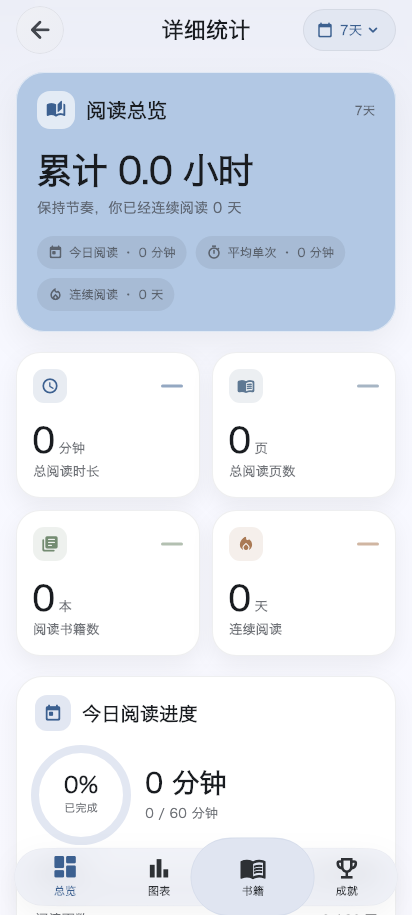

# 阅读统计详情页弹性导航

`DetailedStatsPage` 的总览、图表、书籍、成就导航复用首页的 `ElasticPillNavigationBar`。保留现有 `FloatingPillNavigationSurface`，因此超椭圆外形、毛玻璃开关、配色、尺寸和安全区继续沿用原配置。

页面只提供 TabController 的选中索引和原 `_handleTabTap` 回调。按钮关闭自己的固定选中背景，避免与移动高光叠成两层；不再在页面重复包 Expanded，由共用导航组件分配宽度。PageView 左右滑动仍反向同步导航。

## 验证

- 详情页独立进程回归通过：按压膨胀不改变布局；高光在松手前跟随拖动；取消后回到原页；松手切换目标页；点击和内容左右滑动同步选中索引。
- 同一回归覆盖 412×915、320×700，以及平板横屏 1194×834、竖屏 834×1194，未发现溢出或导航位置变化。
- 带中文字体的实际组件截图通过视觉检查：高光允许膨胀到外壳之外，背景边界稳定，没有重复的静止选中背景。
- 共用弹性导航 6 项、悬浮子页框架 5 项回归各自独立运行通过；详情页 1 项完整交互回归通过，共 12 项。两个改动 Dart 文件静态分析无问题。



[平板横屏](../previews/glass-elastic-20261007/stats/stats-tablet-1194.png) · [平板竖屏](../previews/glass-elastic-20261007/stats/stats-tablet-834.png)

复现截图：

```sh
STATS_SCREENSHOT_DIR=/tmp/stats-preview \
STATS_PREVIEW_FONT='/System/Library/Fonts/Hiragino Sans GB.ttc' \
flutter test --no-pub test/detailed_stats_page_test.dart
```

截图使用独立临时数据库，无真实账号、书籍或阅读记录。实际平板手势验收、GPU 性能和正式发布仍需分别验证。

## Android 构建边界

主工作区整包构建被另一个正在进行的账号页改动阻断：`account_membership_part.dart` 引用了尚未生成的 `accountInvite*` 本地化字段，首次构建时 `_CampaignStateBadge` 也尚未写入。未修改或回退该工作。

从已提交的 `ad5e451a` 创建隔离 worktree，仅放入本次两个 Dart 文件，`flutter build apk --debug --target-platform android-arm64 --no-pub` 通过。构建前确认两个文件与主工作区逐字节一致。该验证包不包含其他未提交工作，保留在 `/tmp/origo-stats-navigation-preview/origo-stats-navigation-debug.apk`；不覆盖平板上包含其他调试改动的版本。

APK SHA-256：`13a978720287c805cf1a61819f0151e5f08735d96f41c2f675bff750147ccd63`。
