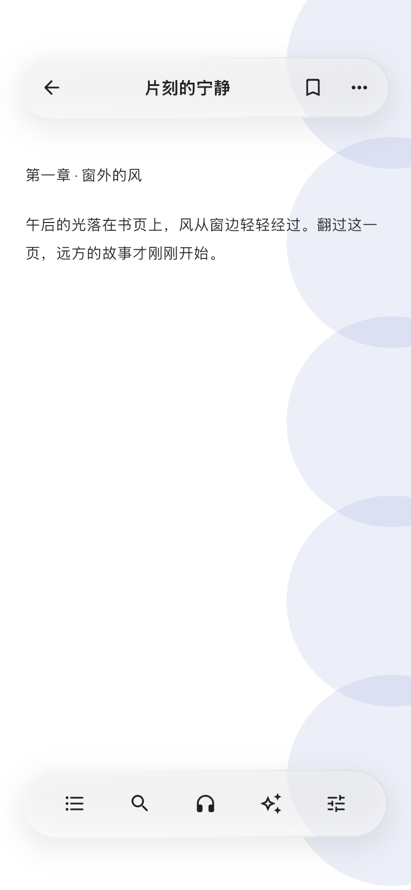
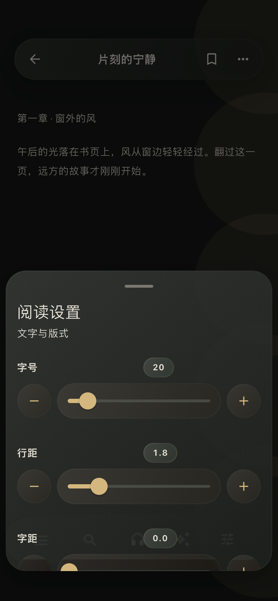

# 2026-10-10 共享底部菜单、液态光照与阅读栏验证

这是一份当日实施与验证记录。当前维护约定见[共用玻璃材质](../glass-material.md)、[底部菜单](../bottom-sheets.md)和[阅读调节控件](../reader-adjustments.md)。

## 本次行为

- 液态边缘使用阅读/应用语义配色的方向性反光与背光。深色减弱白边，浅色增加柔和暗侧轮廓；沿原边缘绘制，未额外添加均匀描边。染色、模糊、折射与毛玻璃/实底策略保持原有共享契约。
- 全部 58 个生产底部菜单调用、35 个入口文件迁移到 `showGlassBottomSheet<T>`。共享外壳提供单一 panel 背景、28 点圆角、8 点外间距、顶部横条、原生下拉关闭及 300/220 毫秒进出动画。保留业务内容高度、键盘 inset、滚动控制器、泛型结果和不可关闭导入事务。
- 可以实时切换阅读配色的本地、书源与漫画阅读设置由内容持有唯一 `GlassBottomSheetSurface`；配色、玻璃、文字及横条一起更新。路由继续持有关闭和安全区规则。
- 标题栏与控制栏只绘制一层 floating 背景。栏内操作是 44 点透明原生按钮，图片/PDF/漫画阅读栏的页码及图标标签也直接置于玻璃条上。两类栏共用整条按压、阻尼拖动和回弹；减少动态效果时静止。
- 删除重复的菜单背景、旧横条和栏内按钮玻璃，复用 `GlassMaterial`、`GlassSurface`、`ElasticPress` 与原生路由，未增加依赖。

## 代码与回归

入口：`lib/utils/glass_material.dart`、`lib/widgets/glass_bottom_sheet.dart`、`lib/widgets/reader_control_chrome.dart`、`lib/pages/reader/image/image_reader_chrome.dart`。

32 个隔离 Flutter 进程共 **290 项通过、0 跳过**。记录为 `build/glass-sheets-20261010/verified-results.json`，各套件日志保留在同一目录；不将合并进程的全局状态污染当成产品失败。

| 验证范围 | 关键证据 |
| --- | --- |
| 光照及既有材质 | 新光照 7 项、既有液态表面 7 项；改变前新光照回归出现 6 项失败，改变后全部通过 |
| 共用底部菜单 | 14 项，覆盖单一背景/横条、typed result、返回/遮罩/下拉/中止、底部安全区、键盘/大字、减少动态效果、不可关闭事务及 day→pureBlack 实时配色 |
| 阅读栏 | 11 项，覆盖整体形变、阻尼范围、松手回弹、拖动取消点击、一次点击、禁用/tooltip/44 点命中及减少动态效果 |
| 图片阅读栏 | 1 项窄屏大字及操作回归，确认两个背景/两个整条弹性组件、零按钮玻璃背景 |
| 迁移消费者 | 设置、目录、字体、朗读、漫画/图片、笔记、AI、自动翻页、搜索、触控区域、书库导入、书源事务/组织/清理、替换规则等原行为与持久化 |

Dart 分析覆盖所有本次源文件、修改测试及预览工具，结果无问题。`git diff --check` 通过。独立复核修正动态阅读配色归属后批准，最后复核无可操作问题。

共享外壳减少了菜单可用内容空间，两处旧测试曾点击屏幕外的控件；改为先滚动到控件再点击，保留设置持久化、缺少目标校验及编辑返回值等所有原断言。

## 原生视觉与交付

真实 iOS 27 / iPhone 18 Pro Max 模拟器使用生产 `GlassSurface`、`ReaderControlBar`、`ReaderSettingsSheetFrame` 和调节控件，共 18 个场景、6 个整条按压/拖动/回弹帧，合计 **24 张原生渲染截图**。`ImageFilter.isShaderFilterSupported=true`，原生构建通过，主要与独立二次视觉复核均 PASS；不是无 shader 的 headless 渲染替代品。

图像与渲染环境保存在 `docs/previews/shared-glass-sheets-20261010/`。覆盖白色、夜色、纯黑、深蓝、羊皮纸、毛玻璃、实底、高对比、320 点/2.4 倍文字、短屏、操作菜单和阅读栏。真实模拟器录屏截取的 [整条按压/拖动/回弹](../previews/shared-glass-sheets-20261010/reader-bars-motion.gif) 可直接预览；原始录屏留在 `build/glass-sheets-20261010/native-preview.mp4`。

功能提交 `117b4882` 已推送。合并产品由 `6d18e459` 构建为 **2.7.3 / 261010005**，使用 `lib/main.dart` Release、本地直接分发和开发者签名。构建前后完整产品源码及生成配置一致，严格签名核验通过；本次 49 个相关源文件逐一与最终包的源码清单核对，五个共享核心文件与原验证版本一致。合并后的听书布局改动保留在消费者中，底部菜单仍统一使用共享入口。

2026-10-10 已保留数据覆盖安装到 **SloanePro / iPhone 16 Pro**（UDID `00008140-001979421E93001C`），设备身份及安装后的 `com.niki.xxread`、版本 `2.7.3`、构建号 `261010005` 均独立读回确认。证据保存在 `build/glass-sheets-20261010/device-delivery-261010005.json`，统一安装者的签名与安装收据为 `build/theme-market/icon-size-261010005/signed-build.json`。这是本地验收安装；TestFlight / App Store 未发布。

手机解锁后成功启动，PID **30532**；运行进程已独立读回确认。设备安装和启动均已完成。真实书籍场景的视觉与 Q 弹手感仍待用户体验确认，独立于已通过的原生预览、签名构建、安装和启动证据。
