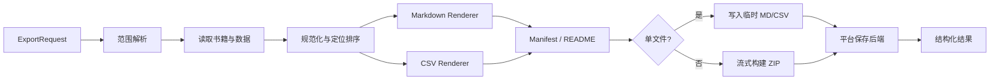

# 阅读数据导出功能设计

> 状态：Draft
>
> 日期：2026-08-17
>
> 依赖：`DESIGN.md`、`lib/models/book_note.dart`、`lib/models/book.dart`、`lib/services/reading/reading_stats_dao.dart`、`lib/services/books/book_export_service.dart`

## 1. 目标

为 Origo X 提供本地优先、范围透明、可长期保存的阅读数据出口。用户可以：

1. 将笔记、高亮和批注导出为可读、可迁移的 Markdown。
2. 将阅读统计独立导出为适合分析的 CSV；后续可选 JSON。
3. 导出当前书籍截至最远阅读位置的数据、当前整本书的数据，或整个书库的数据。
4. 在导出前明确知道包含什么、不包含什么、会生成哪些文件，以及可能暴露哪些私人信息。

该功能不是书籍原文件导出，也不是 WebDAV 同步，更不是 Markdown 双向同步。

## 2. 非目标

首版不包含：

- 导出电子书全文或绕过 DRM。
- 将阅读数据写回 EPUB、PDF 等源文件。
- Markdown 双向同步或导入用户修改后的 Markdown。
- 自动定时导出。
- 自定义模板语言。
- 密码保护 ZIP。
- Web 端文件导出承诺。
- 将“导出数据”与现有“导出书籍文件”合并成同一操作。

## 3. 当前实现基础与约束

### 3.1 已有数据

- `BookNote` 已统一承载 `highlight`、`underline`、`note`，并具有稳定的 `annotationId`、章节、页码、偏移、创建/更新时间和 `canonicalLocator`。
- `Book` 保存当前阅读进度、当前 CanonicalLocator、总页数和内容哈希，但目前没有独立的“历史最远阅读位置”。书源书籍的 shelf progress 也需要统一进入该模型，不能只覆盖本地文件阅读器。
- `reading_sessions` 保存书籍、开始/结束时间、时长和阅读页数；`reading_stats` 只保存按日聚合时长，没有 `bookId`。
- `ReadingStatsDao` 已能生成每日统计、每书汇总、会话概览和小时分布，但 `reading_stats` 与 `reading_sessions` 存在新旧聚合来源，导出必须沿用“当日存在有效 session 分段时优先”的去重语义。
- `Bookmark` 与笔记是不同数据域。首版可以在高级选项中包含书签，但不应把书签默认称为“高亮、下划线与笔记”。
- 当前 WebDAV 的 notes 数据集仍被禁用且远端元数据未启用端到端加密。因此 P0 导出的是本机数据库在导出时刻可见的数据，不得暗示已经汇总其他设备上的最新笔记；若未来开启 notes 同步，导出前再增加同步状态检查，但导出文件是否加密仍是独立能力。
- `reading_stats.date` 当前没有唯一约束，`recordReadingSession` 写会话和 daily 聚合也不在同一事务；repository 必须按日期归并并优先采用会话数据，不能假设每日期只有一行或两张表原子一致。
- `reading_sessions.bookId` 没有外键，删除书籍后可能存在孤立统计。导出时不得丢弃这些记录，应归入“已删除或未知书籍”，同时避免暴露失效的本地 ID。
- `BookNote.copyWith` 不能清空 nullable 字段，且相等比较只看本地 `id`；导出聚合、去重和增量 identity 必须显式使用稳定 `annotationId`，不能依赖 `copyWith` 或 `operator ==`。

### 3.2 已有导出能力

- 书库中的现有“导出书籍”只复制书籍原文件，不包含阅读数据。
- `BookExportService` 的领域语义是“书籍文件副本”，不应扩展为阅读数据导出服务。
- Android 现有后端可直接将文件写入 Downloads；iOS 已能通过系统文档导出；Windows、macOS、Linux 使用保存文件选择器。阅读数据后端可沿用这些平台能力，但 Android 不会弹出系统分享面板。
- Web 后端当前返回 unsupported，首版继续明确标注不支持。
- 旧的单条笔记纯文本 formatter 从未接入导出流程，现已删除；Markdown/CSV 导出应直接建立在版本化导出 DTO 上。项目仍没有已接线的系统文件分享插件。
- 系统 Open With / Share to App 的入站扩展目前只接收 TXT、EPUB，这与本功能的出站保存无直接关系；未来增加“分享导出文件”时需要单独实现出站 URI 和临时文件生命周期，不能复用入站扩展。
- iOS Share Extension 是否实际进入发行 Archive 仍需发布产物验证，但不阻塞 P0 的系统文档保存能力。

### 3.3 新领域边界

当前 SQLite 数据库版本与具体表结构属于实现细节，导出协议不能直接镜像数据库行。必须先聚合为版本化 DTO，避免数据库迁移、旧 CFI 合并语义或平台存储差异直接泄漏到 Markdown、CSV 和 manifest。

新增独立的 `reading_data_export` 领域，建议包含：

```text
lib/services/export/
├── reading_data_export_models.dart
├── reading_data_export_service.dart
├── reading_data_export_repository.dart
├── markdown_notes_renderer.dart
├── reading_stats_csv_renderer.dart
├── export_archive_builder.dart
├── export_manifest.dart
└── reading_data_export_backend.dart
```

平台后端可以复用现有临时文件和系统保存能力，但不能复用 `BookExportService.export(Book)` 这一书籍文件语义。

## 4. 核心产品模型

导出配置不能只用一个“范围”枚举，因为笔记范围和统计范围的含义不同。模型需要拆为四个正交维度：

1. **数据类型**：高亮、下划线与笔记 / 阅读统计。
2. **书籍范围**：当前书籍 / 选择书籍 / 整个书库。
3. **内容边界**：截至最远阅读位置 / 当前整本书，仅适用于高亮、下划线与笔记。
4. **统计日期**：当前筛选时间段 / 自定义日期 / 全部时间，仅适用于阅读统计。

建议领域模型：

```dart
enum ExportDataset { annotations, readingStats }
enum ExportBookScope { currentBook, selectedBooks, entireLibrary }
enum AnnotationExtent { furthestReadPosition, wholeBook }
enum StatsDateRangeKind { currentFilter, custom, allTime }
enum ExportContainer { markdownFile, zipArchive }
```

当同时选择两类数据时，书籍范围共用；内容边界和统计日期分别配置。

## 5. 范围逻辑

### 5.1 “看到一半导出”

面向用户的名称使用：

> 截至最远阅读位置

定义：导出当前书籍从开头到该书历史最远可验证阅读位置之间的笔记、高亮与批注。

不使用“当前停留位置”作为边界。用户可能回翻到序言，如果按当前页面过滤，导出内容会意外缩水。

确认区显示可核验的边界：

```text
截至第 8 章 · 42%
包含 30 条高亮、7 条下划线、12 条笔记
另有 3 条记录位于此范围之后
```

### 5.2 “整本书导出”

定义：导出当前书籍全部章节中的所选用户数据，包括位于当前阅读进度之后的笔记。

固定说明：

> 仅导出这本书中的用户数据，不包含书籍全文或书籍文件。

### 5.3 “整个书库导出”

定义：导出书库中每本书的所选数据。没有相关数据的书自动跳过，不生成空 Markdown。

书库入口不展示含糊的“当前已读部分”。如果后续需要“所有书分别截至最远位置”，应使用完整名称：

> 每本书截至其最远阅读位置

首版建议整个书库固定导出每本书的全部高亮、下划线与笔记，降低范围理解成本。

### 5.4 统计范围不使用“已读部分 / 整本书”

阅读会话当前只关联 `bookId`，没有会话起止的 CanonicalLocator。将统计拆成“截至半本”和“整本”没有可靠数据基础，也不符合用户心智。

统计使用：

- 当前书籍 / 选择书籍 / 整个书库；
- 最近 7 天 / 30 天 / 90 天 / 1 年 / 全部 / 自定义日期。

从阅读统计页进入时，默认继承页面当前时间筛选；确认页明确显示日期范围。

### 5.5 最远位置的数据要求

当前 `Book` 只有最近保存位置，不足以可靠实现“最远阅读位置”。该能力有三态：`available`、`notYetRecorded`、`invalidated`。只有 `available` 可用于过滤；后两种状态下 UI 禁用该范围且不生成伪边界。

实现该范围前需要新增并持久化：

- `furthest_reading_progress`：0.0–1.0；
- `furthest_canonical_locator`：对应最远位置的布局无关定位；
- `furthest_reading_updated_at`：便于诊断和同步。

更新规则：

1. 正常阅读过程中，仅当新的 progression 大于历史值时更新。
2. 用户回翻不降低最远位置。
3. 排版变化只重算渲染位置，不降低 canonical 最远位置。
4. 书籍内容版本变化且签名不匹配时，将边界标为“需要重新确认”，不能静默扩大到整本书。
5. 用户直接跳到末章会把最远位置推进到末章；产品文案使用“最远阅读位置”，不声称系统能判断用户是否逐字读完。
6. 旧书迁移状态为 `notYetRecorded`，不使用最近位置初始化最大值；内容签名变化导致不可比较时状态改为 `invalidated`。
7. “截至最远阅读位置”不是阅读器默认项；P0 默认导出整本书的全部用户批注，避免漏导。

### 5.6 批注是否位于边界内

批注与最远边界必须转换为同一份、同一内容签名下的可比较排序键，建议按以下优先级构造：

1. 目录中的章节顺序 + 章节内 UTF-16 偏移；
2. 同一内容签名且语义明确为全书位置的 `positionHint / totalPositionsHint`；
3. 格式适配器明确证明为全书 progression 的值；
4. 页码 / 总页数降级；
5. 无法比较则标记为 `unresolved`。

`CanonicalLocator.progression` 在当前模型中没有强制声明是全书还是资源内进度，不能脱离格式适配器直接比较。也不得只比较 `pageNumber`，因为页码可能受字号、屏幕和排版影响。

遇到无法定位的记录时：

- 整本书范围：包含该记录；P0 只在生成日志和可选 README 摘要中记录无法定位数量，不将逐条定位质量或稳定 ID 写入 manifest。
- 截至最远位置：确认页显示“有 N 条记录无法判断是否在范围内”，默认不纳入；高级选项允许用户明确包含。
- 不得静默把整个范围扩大为整本书。

## 6. 数据边界

### 6.1 高亮、下划线与笔记导出

默认包含：

- 书名、作者、格式；
- 高亮/下划线原文；
- 用户批注；
- 类型与高亮颜色；
- 章节和自然语言位置；
- 创建时间和修改时间；
- 稳定 `annotationId`，写入不可见注释供后续增量更新。

默认不包含：

- 电子书全文；
- 本地绝对文件路径；
- 账户、设备和 WebDAV 信息；
- 高亮前后额外上下文；
- AI 对话；
- 封面文件；
- 旧版 `ink` 记录。

高级选项：

- 包含书签；
- 包含高亮颜色；
- 包含创建/修改时间；
- 包含稳定位置元数据；
- 每章拆分文件（P1）。

### 6.2 阅读统计导出

统计和批注必须在文件级分离。统计文件不包含高亮原文、批注正文、标签或书籍本地路径。

P0 默认导出：

- `books.csv`：仅汇总能归属到书籍的 `reading_sessions` 分段；
- `daily.csv`：固定为“一行 = 日期 + 书籍”的日粒度，另允许一行 `record_kind=unassigned` 表示无法归书的旧聚合；
- `README.md`：统计来源、口径、时区、缺失值和旧数据限制。

当前数据库中的 `reading_sessions` 行不是可靠的“用户原始会话”：一次跨午夜阅读会被拆成多行，且没有共同的逻辑会话 ID。因此 P0：

- UI 不展示“会话次数”；
- `books.csv` 和 `daily.csv` 不导出 `session_count`；
- 不提供名为 `sessions.csv` 的文件；
- 可在诊断用途导出 `activity_chunks.csv`，但必须明确称为“统计分段”，默认关闭，不等同于用户开始的一次阅读。

P1 先为新会话增加稳定 `logical_session_id`，再提供真正的 `sessions.csv`。历史分段无法可靠还原为原始会话，必须标记为 unavailable，不能按相邻时间武断合并。

### 6.3 CSV 字段与固定口径

`books.csv`：

```text
book_id,title,author,format,progress_percent,total_reading_seconds,pages_read,first_read_at,last_read_at
```

`daily.csv`：

```text
date,timezone,record_kind,book_id,title,reading_seconds,pages_read
```

其中 `record_kind` 只能是：

- `book`：由 `reading_sessions` 按日期和书籍聚合；
- `deleted_book`：分段带有 `bookId`，但书籍已不存在；
- `unassigned`：只有旧 `reading_stats` 聚合，无法归属书籍。

去重算法固定为按日期执行：

1. 当某日存在一个或多个有效 `reading_sessions` 分段时，以这些分段为该日时长真相源，按书籍聚合；忽略该日 `reading_stats`，沿用当前 DAO 的“会话优先”语义。
2. 当某日不存在有效分段时，将该日所有 `reading_stats` 行求和，写一条 `record_kind=unassigned`，`book_id`、`title` 和 `pages_read` 留空。
3. `books.csv` 只汇总 `record_kind=book`；`deleted_book` 和 `unassigned` 不虚构书籍归属，汇总值可能小于 `daily.csv` 全部时长，README 必须显示差额和原因。
4. 选择单本书导出统计时，只包含能归属该书的 `book` 行；无法归属的旧全局时长不能纳入，也不能按比例分摊。确认页显示“早期未归属统计不包含在单书结果中”。

若 `reading_sessions.bookId` 已找不到对应书籍，保留时长和日期并使用 `record_kind=deleted_book`，标题显示“已删除或未知书籍”，稳定导出书籍 ID 留空。

### 6.4 CSV 编码与安全

- 规范文件为 UTF-8、CRLF、RFC 4180，默认带 UTF-8 BOM，以提升 Excel 对中文的识别；高级机器可读模式可关闭 BOM，但文件内容相同。
- 时间使用 ISO 8601，README 声明导出时区。
- 对文本字段先完成 RFC 4180 引号转义，再执行公式注入防护：若去除 Unicode 前导空白后的首字符是 `=`, `+`, `-`, `@`，或原值以 Tab/CR/LF 开头，则在字段值前添加单引号 `'`。README 明确该前缀是安全转义，不属于原始书名或作者。
- 数值、ISO 日期和固定枚举由类型化 renderer 生成，不接受任意字符串，因此不添加单引号。
- `books.csv` 与 `daily.csv` 是两个视图，不能相加；README 明确每个文件的粒度和来源。
- 若启用 `activity_chunks.csv`，字段固定为 `chunk_id,logical_session_id,book_id,started_at,ended_at,duration_seconds,pages_read`；P0 的 `logical_session_id` 留空，`chunk_id` 仅为本文件内顺序号，不充当稳定身份。

## 7. Markdown 设计

### 7.1 设计原则

“精美”主要来自清晰层级、留白和稳定结构，而不是依赖专有 HTML 或 CSS。

导出 Markdown 应：

- 兼容 CommonMark、GitHub、Obsidian、Typora、VS Code；
- 使用 YAML Front Matter；
- 每本书一个文件；
- 按章节和书内顺序组织；
- 原文使用引用块，用户批注使用正文；
- 不依赖颜色表达核心语义；
- 对 Git diff 友好，同一条记录重复生成时结构稳定；
- P0 可读 Markdown 不嵌入 annotation UUID、内容摘要或不可见跟踪标记；协议元数据只放在可选 manifest 中。

### 7.2 默认模板

```markdown
---
schema: origo-x.notes/v1
title: "思考，快与慢"
author: "丹尼尔·卡尼曼"
book_id: "or-book-a7c21d"
exported_at: "2026-08-17T21:40:00+08:00"
export_scope: "furthest_read_position"
reading_progress: 42
annotation_count: 49
---

# 《思考，快与慢》

> **作者**：丹尼尔·卡尼曼  
> **导出范围**：截至第 8 章 · 42%  
> **内容**：30 条高亮 · 7 条下划线 · 12 条笔记  
> **导出时间**：2026 年 8 月 17 日 21:40

---

## 第三章 · 锚定效应

### 高亮 · 09:32

> 当人们考虑某一特定值时，他们对未知数量的估计会受到该值影响。

**我的批注**

这可以解释为什么先看到原价后，更容易接受折扣价。

`位置：第 56 页` · `颜色：黄色` · `更新于：2026-08-10`


```

### 7.3 模板细节

- 文件标题只出现一次 H1。
- 章节使用 H2。
- 每条记录使用 H3，显示类型和可选时间。
- 每一行原文都加 `> `，保留段落结构。
- 用户批注为空时不显示“我的批注”标题。
- 纯笔记没有原文时，直接显示正文。
- 颜色是辅助元数据；未知颜色显示 hex，不生成错误色名。
- 页码不可用时显示章节或进度；不向普通用户展示原始 CFI。
- Markdown 必须按上下文渲染，不能使用一个全局 `replaceAll`：
  - YAML Front Matter 的用户字符串统一使用 JSON 兼容的双引号标量，转义 `\\`、`"`、控制字符和换行；禁止原样插入 `---` 多行块。
  - H1/H2/H3 标题中的换行折叠为空格，并转义反斜杠、`#`、`[`、`]`、`<`、`>` 和行首列表/引用标记，避免改变文档结构。
  - 高亮原文按逻辑行输出，每一行前置 `> `；空行输出单独的 `>`；原文中的 HTML 保持纯文本可见，至少转义 `&`, `<`, `>`，不允许形成活动 HTML。
  - 用户批注正文保留段落和列表表达，但转义原始 HTML 标签；任何可能产生 HTML 注释的 `<!--`, `-->` 都编码为可见文本。
  - 稳定 ID 不再拼入 HTML 注释。若 P1 更新需要块标记，使用仅由 renderer 生成的固定 ASCII token，并对 ID 做 base64url 或严格 `[A-Za-z0-9_-]` 校验，禁止用户内容进入注释。
  - 行首 `---`、`+++` 等只在正文中按普通文本处理，不能提前关闭 Front Matter。
- 文件使用 UTF-8、LF 换行，末尾保留一个换行。
- 默认语言跟随应用当前语言；稳定 schema 字段使用英文 code。

### 7.4 排序

默认排序：

1. 章节在目录中的顺序；
2. 章节内 canonical position；
3. 相同位置按创建时间升序；
4. 无法定位的记录放到“未定位的笔记”章节，按创建时间排序。

不按数据库 `id` 或当前 DAO 的 `page_number ASC, create_time DESC` 直接输出。

## 8. 文件与容器结构

### 8.1 单本书，仅高亮、下划线与笔记

直接生成一个 `.md`：

```text
思考，快与慢—丹尼尔·卡尼曼.md
```

这是移动端最短路径，适合立即保存；若 P1 增加独立分享动作，也可直接分享该文件。

### 8.2 多本书或同时导出多类数据

生成 ZIP：

```text
Open-Reading-Export-2026-08-17.zip
└── Open-Reading-Export-2026-08-17/
    ├── README.md
    ├── notes/
    │   ├── 丹尼尔·卡尼曼/
    │   │   └── 思考，快与慢.md
    │   └── 未知作者/
    │       └── 书名.md
    ├── statistics/
    │   ├── README.md
    │   ├── books.csv
    │   ├── daily.csv
    │   └── activity_chunks.csv # 可选诊断分段，不代表逻辑会话
    └── manifest.json
```

### 8.3 文件名与 ZIP 条目安全

人类可读文件名：

- 移除 C0/C1 控制字符、NUL、双向控制符和 `<>:"/\\|?*`；
- 将 `/`, `\\`, Unicode division slash、fraction slash 等分隔符归一为安全横线；
- 合并连续空白，拒绝 `.`、`..`、空名、绝对路径、盘符和 UNC 前缀；
- 处理 Windows 保留名和末尾句点/空格；
- 按 Unicode NFC 规范化并限制 UTF-8 字节长度；
- 同一导出包内发生同名冲突时，按稳定排序添加人类可读序号，如 `局外人—加缪 (2).md`；P0 不为文件名引入可跨导出关联的稳定别名；
- 不在文件名中暴露本地数据库 ID 或完整 UUID。

ZIP 构建器只接受 renderer 生成的相对 POSIX 条目名，并强制：

1. 将 `\\` 转为 `/` 后逐段验证，不允许空段、`.`、`..`、前导 `/`、盘符、URL scheme 或 NUL。
2. 归一化后的条目必须位于固定根目录 `Open-Reading-Export-…/` 下。
3. ZIP 中只创建普通文件和目录，不创建 symlink、hardlink、device entry 或保留外部文件权限。
4. 处理 NFC、大小写折叠后的冲突，确保在 Windows/macOS 解压不会覆盖。
5. 限制单条目名、总条目数和未压缩总大小；写入前后校验计数，防止异常数据产生 ZIP bomb 风格产物。
6. 测试使用 `../evil`、`C:\\evil`、`/absolute`、Unicode 分隔符、大小写冲突和 symlink 属性样本。

### 8.4 Manifest

P0 manifest 只描述本次快照的结构和口径，不为尚未实现的增量更新提前泄漏稳定记录标识：

```json
{
  "schema": "origo-x.export/v1",
  "created_at": "…",
  "app_version": "…",
  "datasets": ["annotations", "reading_stats"],
  "book_scope": "entire_library",
  "files": [
    {"path": "notes/作者/书名.md", "kind": "annotations", "records": 49}
  ]
}
```

P0 manifest 不写入 annotation UUID、`export_book_id`、本地 `bookId`、内容哈希、digest、绝对路径、账号、设备 ID 或密钥。隐私摘要明确说明 ZIP 内含 manifest，但只包含文件清单和计数。

P1 “更新已有导出”需要稳定 ID 和 digest 时，必须重新做协议和隐私评审：

- 将稳定关联标识列入导出确认页的隐私摘要；
- digest 使用带导出包随机 salt 的 HMAC，而不是可跨导出关联的裸内容哈希；
- salt 只存在该导出包内，不能由设备 ID 或账户 ID 派生；
- 用户可选择不生成可更新 manifest，此时只能创建新快照。

## 9. UI 信息架构

### 9.1 入口

提供上下文入口和全局入口，统一进入同一个导出流程并预选合理配置。

#### 阅读器

阅读导航底部面板当前用户可见的“笔记”Tab（组件内部承载 annotations）顶部增加导出图标：

- 默认选中“高亮、下划线与笔记”；
- 默认书籍范围为当前书；
- P0 默认内容边界为“整本书”；可信最远边界存在时，用户可改选“截至最远阅读位置”。

不要把导出按钮放到每一条笔记的三点菜单中；单条笔记分享是另一个操作。

#### 书籍详情

将现有“导出书籍”文案明确为“导出书籍文件”，并新增独立的“导出阅读数据”：

```text
导出阅读数据       高亮、下划线、笔记与阅读统计
导出书籍文件       保存 EPUB / PDF / TXT 原文件
```

#### 阅读统计页

顶部时间范围选择器旁增加导出按钮：

- 默认选中“阅读统计”；
- 默认继承当前 7 天 / 30 天 / 90 天 / 1 年 / 全部筛选；
- 书籍范围默认为整个书库，若当前页面处于单书筛选则继承单书。

#### 设置页

新增全局页面建议位于 `lib/pages/settings/data_export_page.dart`，在“数据与服务”分区加入“导出阅读数据”：

```text
导出阅读数据
高亮、下划线、笔记与阅读统计
```

该入口默认不预选当前书，第二步显示“选择书籍 / 整个书库”。

### 9.2 导出流程

手机使用三步全屏流程；桌面宽屏可在右侧持续展示摘要，但步骤和字段一致。

#### 第一步：导出什么

使用可多选的数据卡，不使用单选：

```text
导出阅读数据                         1/3

选择内容

[x] 高亮、下划线与笔记
    精美 Markdown · 49 条

[ ] 阅读统计
    CSV · 2025-08-17 至今

                         [继续]
```

规则：

- 至少选择一种数据。
- 数量加载期间使用骨架或“正在统计”，不显示假数字。
- P0 不显示“包含会话明细”。高级诊断可显示“包含统计分段”，默认关闭，并解释跨午夜可能拆成多行。

#### 第二步：导出哪些书

从阅读器或书籍详情进入：

```text
(o) 当前书籍
    《思考，快与慢》

    批注范围
    (o) 整本书
        全部章节 · 52 条 · 不包含书籍全文
    ( ) 截至最远阅读位置
        第 8 章 · 42% · 49 条

( ) 选择其他书籍
( ) 整个书库
```

`整本书` 是 P0 的安全默认。只有该书已经在新版本中产生可信最远边界时，才启用“截至最远阅读位置”；否则禁用并显示：

> 最远位置从此版本开始记录，目前还不能可靠确定。你仍可导出整本书的全部批注。

从设置或书库进入：

```text
(o) 选择书籍       34 本有可导出数据
( ) 整个书库       128 本，空书将跳过
```

若同时导出统计，在同页单独显示统计日期：

```text
统计日期
最近 30 天                                      ›
```

#### 第三步：预览并导出

```text
导出预览

内容        高亮、下划线与笔记
书籍        《思考，快与慢》
范围        截至第 8 章 · 42%
结果        1 个 Markdown · 49 条记录

隐私摘要
包含 30 条高亮原文、7 条下划线原文和 12 条私人笔记。
不包含书籍全文、书籍文件、账户或设备信息。

高级选项                                      ›

[导出 49 条记录]
```

主按钮必须描述动作和数量，不使用笼统的“确定”。

点击后进入平台保存出口，平台语义必须准确：

- Android：现有 MediaStore 后端直接写入 `Download/开元阅读`，用 `firstAvailable` 自动生成不冲突文件名，不弹保存或分享面板；成功后回显实际名称和位置。
- iOS：现有 `UIDocumentPickerViewController(forExporting:asCopy: true)` 导出临时文件副本；用户可以选择目标位置或取消。这是文档导出 picker，不是分享面板。
- Windows、macOS、Linux：`FilePicker.saveFile` 只返回目标路径；现有原子复制逻辑在目标已存在时会备份后替换，不能声称系统一定再次询问。P0 在写入前自行检查目标是否存在，并显示应用内“替换 / 重新选择 / 取消”确认，未经明确选择不得覆盖。

用户取消 picker 或应用内确认时回到确认页，不显示失败。首版不把“分享”与“保存”混成同一承诺。

### 9.3 高级选项

默认折叠：

高亮、下划线与笔记：

- 包含书签：关；
- 显示颜色：开；
- 显示创建/修改时间：开；
- 包含无法定位的记录：仅在存在时显示，默认关；
- 按章节拆分：P1。

阅读统计：

- 汇总统计：开；
- 每日统计：开；
- 统计分段：关，并说明不是逻辑会话且可能暴露作息；
- JSON：P1。

### 9.4 响应式布局

- 手机：单列三步流程，底部固定主按钮，内容可滚动。
- 平板/桌面：最大宽度约 1080px；左侧配置，右侧预览与隐私摘要。
- 触控目标至少 44×44。
- 键盘 Tab 顺序遵循数据类型 → 书籍范围 → 选项 → 导出。
- 进度与错误不只依赖颜色表达。

## 10. 状态与反馈

### 10.1 空状态

当前范围没有笔记，但整本书有：

> 截至最远阅读位置没有笔记。整本书范围内有 3 条记录。

操作：`改为整本书`。不能自动扩大范围。

整个书库中部分书为空：

> 128 本书中，34 本包含笔记，91 本包含统计；3 本没有可导出数据，将被跳过。

不为完全空的书创建空文件。

### 10.2 导出中

- 小型单书 Markdown：按钮内显示“正在生成”。
- 大型书库：显示阶段和数量，如“正在整理第 32/128 本书”。
- 生成文件和系统保存是两个状态；前者失败不能打开系统保存界面。
- 页面退出策略必须明确。P0 不承诺系统杀死应用后继续，文案使用“应用运行期间继续”。
- 不允许同一配置重复启动并发导出。

### 10.3 结果

P0 采用“先完整生成一个最终产物，再交给平台保存”的原子快照语义：

- 任一本书读取或渲染失败时，不发布半成品 ZIP；任务进入失败页，列出失败书籍。
- 用户可以取消失败书籍的选择并重新生成一个新快照，或修复问题后重试整个任务。
- P0 不提供“保存已完成部分”或“只重试 ZIP 中失败条目”，避免临时目录、manifest 计数和单文件保存状态不一致。
- 临时 ZIP 只有在所有条目、README 和 manifest 完成并校验后才标记 ready；平台保存成功或任务取消后按生命周期清理。

成功：

> 已导出 34 本书 · 286 条记录

失败：

> 2 本书无法读取，尚未创建导出文件

提供：`查看问题`、`排除失败书籍后重试`、`重试全部`。

系统保存面板被取消：不显示 Toast，保留确认页；已生成的临时产物只在当前页面生命周期内保留，便于再次选择保存位置，超时或离页后清理。

### 10.4 错误分类

用户可行动错误包括：

- 目标位置无写入权限；
- 可用空间不足；
- 书籍数据读取失败；
- 临时文件创建失败；
- 文件名冲突无法解决；
- 导出平台不支持；
- 应用进入后台导致任务中断。

错误详情不能直接暴露本地绝对路径或数据库堆栈。

## 11. 隐私与版权

导出前始终显示摘要。ZIP 导出还需显示：

> 包含一个文件清单 manifest，仅记录相对文件名、类型和数量，不包含稳定批注 ID 或内容指纹。

默认承诺：

- 不包含书籍全文和书籍原文件；
- 不包含账户、设备、WebDAV 凭据或本地路径；
- 统计文件不包含笔记正文；
- 不包含高亮前后额外上下文；
- 文件未加密，交给第三方应用后不再受 Origo X 控制。

勾选 `activity_chunks.csv` 时显示：

> 统计分段可能反映你的作息和使用习惯。跨午夜阅读会被拆成多行，它们不代表你主动开始的一次完整阅读会话。

“整本书”旁始终显示“不包含书籍全文”。避免用户误认为该功能用于导出电子书内容。

## 12. 重复导出与增量更新

### 12.1 P0：只创建新快照

首版每次生成新文件或新 ZIP，不静默覆盖：

- Android 使用 MediaStore 自动生成不冲突名称；
- iOS 交由 document picker 的目标提供方处理文件名冲突；
- 桌面端在 `saveFile` 返回路径后由应用再次检查是否存在，并要求明确选择替换、重新选择或取消；
- P0 manifest 不包含稳定 annotation ID，只描述本次快照文件和计数。

### 12.2 P1：更新已有导出

增加两种清晰模式：

- 创建新导出；
- 更新已有导出。

更新前展示：

> 自上次导出以来：新增 8 条、修改 3 条、删除 1 条。

安全规则：

1. 只更新带 Origo X 稳定 ID 的应用生成区块。
2. 无法识别的用户新增内容必须保留。
3. 默认不从导出目录删除内容。
4. 应用与 Markdown 同时修改时不静默覆盖，生成冲突副本或中止该文件。
5. 更新前创建可恢复备份。
6. manifest 缺失或 schema 不兼容时，只允许创建新快照。

在块级合并足够可靠前，不发布“更新已有导出”。

## 13. 技术处理流程



实现要求：

- 读取数据库时建立一致性快照或在一次任务中固定查询截止时间，避免计数与文件内容不一致。
- repository 统一聚合 `BookDao`、`BookNoteDao`、可选的 `BookmarkDao` 和 `ReadingStatsDao`，renderer 不直接查询 SQLite。
- 内部 DTO 必须保留稳定 annotation ID、canonical locator、内容签名与定位质量以完成排序和去重，但 P0 renderer 不把 annotation ID 或内容签名写入 Markdown/manifest；本机整数 `bookId` 只能用于本次查询关联，不能进入跨设备导出协议充当稳定身份。
- 大型书库按书流式处理，不把全部 Markdown 和 ZIP 同时留在内存。
- 先写 `.partial` 临时文件，完成并校验后再交给平台后端。
- 任务结束、取消或失败时清理临时文件。
- Markdown、CSV 和 manifest renderer 必须是与 Flutter UI 解耦的纯 Dart 逻辑，便于单元测试。
- 用户可见文本在渲染入口完成本地化；schema code 保持稳定英文值。

## 14. 数据模型补强

P0a 必需：

1. 当前单书整本批注的版本化 DTO、Markdown renderer 和平台保存 sink。
2. 内部去重显式使用 `annotationId`，不依赖 `BookNote.operator ==`。
3. Markdown/YAML/文件名安全策略和测试。

P0b 必需：

1. 若上线“截至最远阅读位置”，`Book` 增加三态最远位置字段，并让本地文件阅读器和书源阅读器走同一更新入口，含迁移和同步策略。迁移时不能把旧版“最近位置”直接声明为历史最远位置。
2. `ReadingStatsDao` 增加按书籍和日期范围读取原始导出数据的专用查询，实现本规格固定的 daily 去重算法，避免 UI 拼接统计结果。
3. P0 内部可以使用本机书籍关系完成查询和同名排序，但不需要新增或导出稳定 `export_book_id`。独立持久化 `export_book_id` 属于 P1 可更新导出协议；内容哈希与书源身份只能用于候选匹配。
4. 对 `BookNote.canonicalLocator` 解析失败给出结构化定位质量，不在 renderer 内临时猜测。
5. ZIP 条目安全构造、原子产物生命周期和大型书库流式测试。

P1 必需：

- 阅读会话记录层新增稳定 `logical_session_id`，同一次跨午夜阅读拆出的各行共享该 ID；迁移前历史分段保持 unavailable，不伪造逻辑会话；
- 增加导出历史和目标目录授权记录；
- 增加记录 digest 与冲突检测。

## 15. 测试与验收

### 15.1 核心逻辑

- 回翻后“截至最远阅读位置”不会缩小。
- 整本书包含进度之后的笔记；截至最远位置不包含。
- 无法定位记录按规则处理，不静默丢失。
- 同章记录按 canonical position 稳定排序。
- Markdown 特殊字符、多行引用、空批注、纯笔记正确输出。
- 中文、繁体中文、日文、英文文件名和内容保持 UTF-8。
- CSV 中引号、逗号、换行和公式注入字符被安全处理。
- daily 与 activity chunks 的时长不会重复累计；某日存在有效分段时优先于旧 daily 聚合，同一天多条 `reading_stats` 会先归并。
- 会话与 daily 聚合部分写入或不一致时，导出仍能产生确定结果并在 README 说明统计来源。
- 孤立 `reading_sessions.bookId` 会保留为“已删除或未知书籍”，不会因关联失败而丢失。
- 本机整数 `bookId` 不会出现在 manifest 中充当稳定跨设备 ID。
- 两个尚未落库的 BookNote 不会因为本地 `id == null` 而被误去重。
- 多本同名书不会覆盖。
- 空书被跳过，部分空数据域不影响另一数据域。

### 15.2 UI

- 从阅读器、书籍详情、统计页和设置页进入时预选正确。
- 数据类型至少选择一个。
- 统计不出现“已读部分 / 整本书”的错误范围。
- 导出预览数量与最终文件一致。
- 系统保存取消不显示失败。
- P0 任何生成错误都不会发布半成品；失败页能区分数据读取、渲染、打包和平台保存失败。
- 屏幕阅读器能读出选择状态、预计数量和导出进度。
- 手机固定按钮不遮挡内容和安全区域。

### 15.3 平台

- Android：验证 `.md` 与 `.zip` 写入 Downloads/开元阅读及重名行为。
- iOS：验证 document picker 导出副本、取消和目标提供方的重名行为；分享目标兼容性仅在独立分享动作进入范围时验证。
- Windows、macOS、Linux：验证保存选择器、原子写入和路径冲突。
- Web：显示明确的不支持状态，不出现无响应按钮；在真正提供 Web 导出前，必须另行验证浏览器文件生成和内存峰值，不能沿用整文件载入内存的导入方式。
- iOS 发布验证：若 P1 引入系统分享，再通过 Xcode Archive 确认 Share Extension 实际包含在发行包中。
- 大书库：验证内存峰值和临时文件清理。

## 16. 分阶段交付

### P0：可靠快照

P0a 先交付最小可靠垂直切片：

- 当前单书的整本高亮、下划线与笔记；
- 一个精美 Markdown；
- 数量、范围和隐私摘要；
- Android、iOS、Windows、macOS、Linux 保存；
- 取消、重名确认、原子失败和 renderer 安全测试。

P0b 在 P0a 稳定后增加：

- 选择多书和整个书库；
- 多文件 ZIP、README 与最小化 manifest；
- 阅读统计 `books.csv` / `daily.csv` 和可选 `activity_chunks.csv`；
- 批注与统计独立选择并在 ZIP 中分域；
- 可信最远边界存在时可选当前书截至最远位置；
- 大书库流式打包和内存测试。

P0a/P0b 都只创建新快照，不发布部分 ZIP。

### P1：长期工作流

- 更新已有导出；
- 导出历史；
- 固定目录；
- JSON 统计；
- 每章拆分；
- 新会话稳定 `logical_session_id` 与真正的 sessions.csv；
- 更新前备份与冲突检测。

### P2：知识管理集成

- Obsidian 优化；
- 应用深链；
- 标签映射；
- 自定义模板；
- 自动定期导出；
- 在独立设计通过后考虑导入或双向同步。

## 17. 待确认决策

1. 首版是否将书签纳入“高级选项”，还是完全延后。
2. 整个书库是否只允许“每本整书数据”，还是也提供“每本截至最远位置”。本设计推荐首版仅整书。
3. 单书同时导出笔记和统计时是否固定为 ZIP。本设计推荐固定 ZIP，确保数据域分离。
4. 是否在 P0 同时加入独立分享动作，还是只提供“保存到文件”。本设计推荐 P0 只保证保存；若要跨平台分享，需要单独设计 Android 分享 URI、iOS 分享面板和临时文件生命周期，不能假设现有保存后端自动支持分享。
5. P1 若采用稳定 `export_book_id`，需确认它是否进入 WebDAV `books` 数据集、是否在删除后保留 tombstone 映射，以及用户是否接受它作为可跨导出关联的标识；P0 不生成该 ID。
